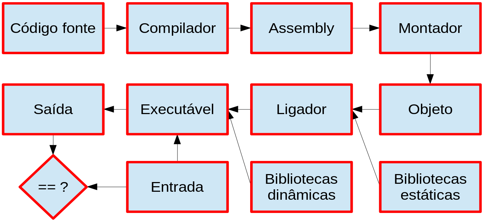

# Benchmarks

**MO601 - Arquitetura de Computadores II**

http://www.ic.unicamp.br/~rodolfo/mo601

Rodolfo Azevedo - rodolfo@ic.unicamp.br

## O que é um benchmark?

* Conjunto de um ou mais programas
* Com suas respectivas entradas
* Com parâmetros de execução
* Utilizados na avaliação de alguma característica
  * Desempenho
  * Consumo de energia
  * Corretude

## Visão Geral da Execução de Programas

## O que impacta do ponto de vista da arquitetura?

* Processador
  - Número de cores
  - Frequência
  - Microarquitetura (pipeline, branch prediction, especulação, largura de unidades funcionais, etc)
* Memória
* Entrada e Saída

## Benchmarks

* Existem muitos benchmarks, com finalidades distintas e capazes de avaliar propriedades diferentes de programas. Dentre eles:

  **ACStone**, AxBench, **BioBench**, **CloudSuite**, CSiBE – Code Size, DaCapo, **Graph500**, HPCC, Mantevo, MediaBench, MiBench, MineBench, NAS NPB, NAS OMP, **Parsec**, Rodinia, San Diego Vision Benchmark Suite, Single source benchmark, **SPEC**, SpecJBB, SpecJVM, SPECWeb, Streamit, Sysbench, TPC

## Ferramentas

* Muitas ferramentas são utilizadas para avaliação de arquitetura. Dentre elas:

  **Cacti** , **Dinero**, Eztrace , FabScalar, Gem5, gprof, Leon , MARSSx86, **Mcpat**, PAPI Performance Monitoring Tool, **perf**, **Pin**, Plasma, Qemu, **Running Average Power Limits (RAPL)**, Simpoint, **Snipper**, ZSim
