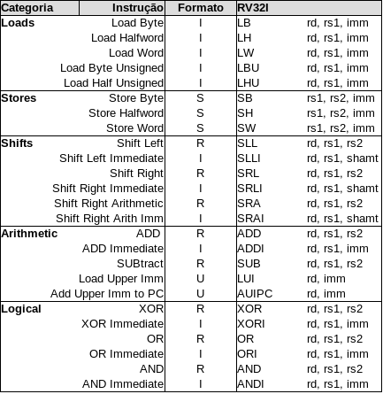

# RISC-V

**MO601 - Arquitetura de Computadores II**

http://www.ic.unicamp.br/~rodolfo/mo601

Rodolfo Azevedo - rodolfo@ic.unicamp.br

## Conjuntos de Instruções do Processador - **ISA**

* *"The portion of the computer that is visible to the programmer or the compiler writer."* - Computer Architecture: A quantitative approach

* *"An instruction set architecture (ISA) is an abstract model of a computer. It is also referred to as architecture or computer arquiteture."* - Wikipedia

* *"A contract HW and SW designers agreed to obey"* - Minha definição de uma linha

* **"Um contrato em que os projetistas de hardware e software concordaram em obedecer"** - Minha definição de uma linha

## Arquitetura vs Microarquitetura

* Arquitetura é o modelo
  * x86, ARM, RISC-V, Power

* Microarquitetura é a implementação
  * Intel i7 geração 11, AMD Ryzen 3, ARM Cortex-A53, RISC-V RV32IMAC, PowerPC 970

* Conjunto de instruções pode ser visto como a borda
  * Pode facilitar ou dificultar a implementação em cada um dos lados

## ISA é importante?

## O que é?

* Conjunto de instruções aberto
  * Sem proteção de patentes
  * Permite implementações independentes
* ISA modularizado
  * Apenas os sub-conjuntos de instruções necessários precisam ser implementados
  * Pacote mínimo de 47 instruções
* Espaços de endereçamento de 32, 64 e 128 bits
* Registradores de 32, 64 e 128 bits
* ISA totalmente virtualizável

## Características

* 32 registradores de inteiros
  * Registrador 0 tem valor fixo em 0
  * Registrador 1 é o endereço de retorno
* Opcionalmente 32 registradores de ponto flutuante conforme IEEE 754-2008
* Memória endereçada em bytes e instruções alinhadas em 32 bits de memória (4 bytes)
* Arquitetura load-store
* Poucos formatos de instruções

## Extensões

|Extensão|Característica|
|---|---|
| RV32I | Conjunto base de instruções de inteiros de 32 bits |
| RV64I | Conjunto base de instruções de inteiros de 64 bits |
| M | Instruções de multiplicação e divisão de inteiros |
| A | Instruções de operações atômicas |
| F e D| Instruções de ponto flutuante de precisão simples e dupla|
| G | Equivalente a IMAFD |
| C | Instruções compactas |

## Ambientes de Execução

| Tipo | Sistema Operacional | Acesso aos Periféricos | Ambiente | Exemplo |
|---|:---:|:---:|---|---|
| Bare metal | Não | Direto | Memória | Arduino |
| Sistema Operacional | Sim | Indireto | Processo | Windows, Linux, iOS, Android |
| Hypervisor | Sim | Indireto | Máquina Virtual | VirtualBox, VMware, QEMU |
| Emulador | Sim | Indireto | Processo | MARS, QEMU |

## Codificação das Instruções

## Instruções RV32I - parte 1

## Instruções RV32I - parte 2

## Instruções RV32M

## Registradores

* O processador RISC-V tem 32 registradores conforme tabela abaixo

