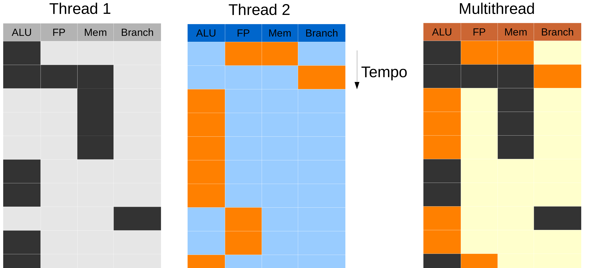
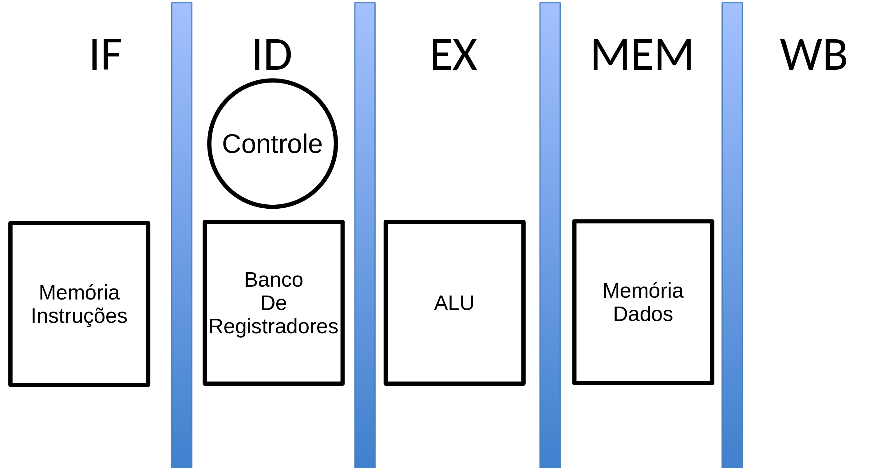
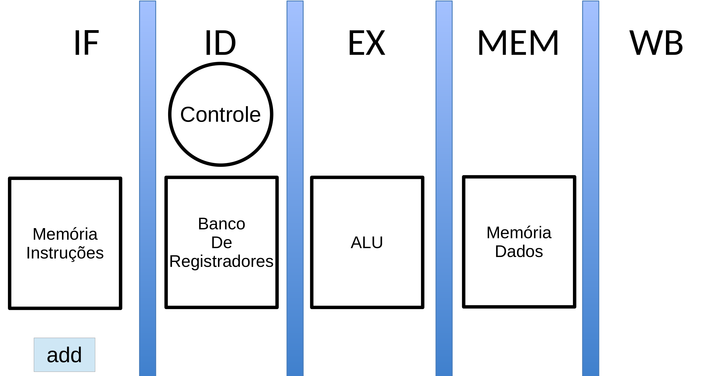
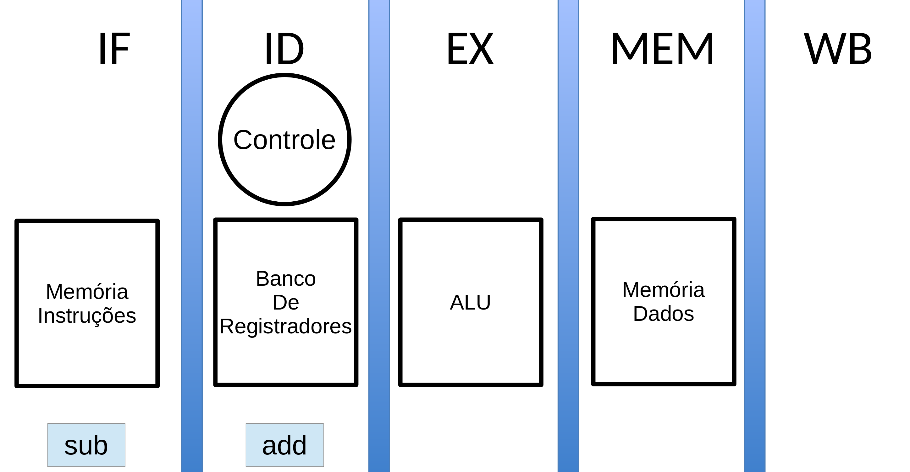
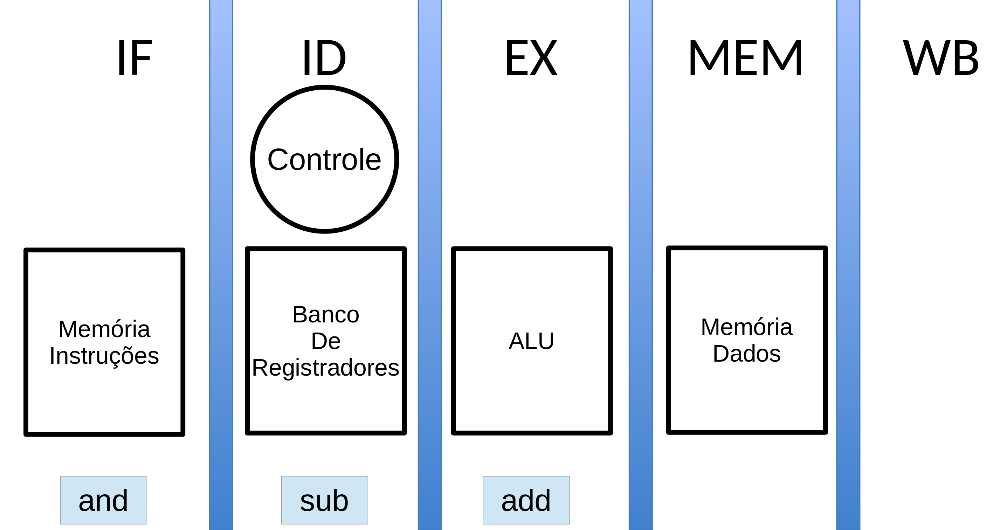
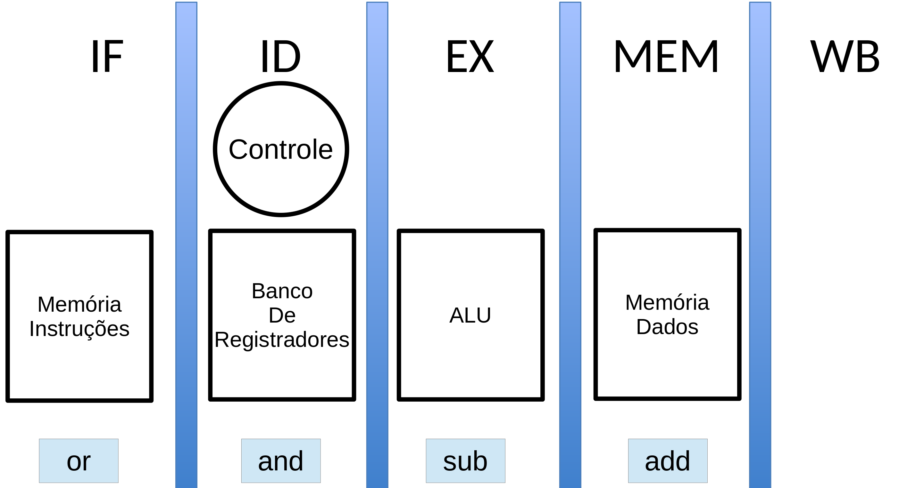
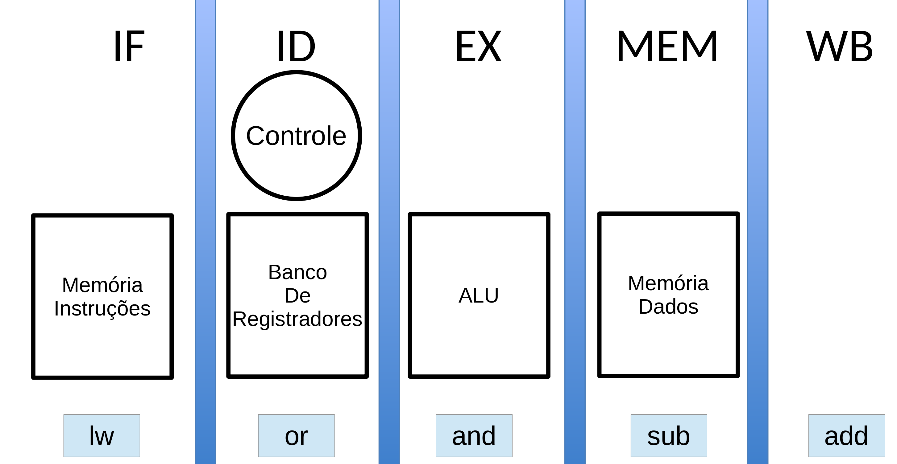
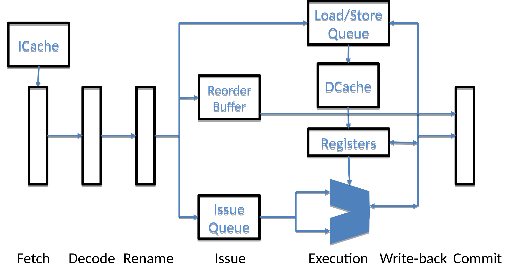

# Visão Geral

**MO601 - Arquitetura de Computadores II**

http://www.ic.unicamp.br/~rodolfo/mo601

Rodolfo Azevedo - rodolfo@ic.unicamp.br

## Como processadores evoluem?

* Novas descobertas microarquiteturais
  - Caches
  - Predição de desvio
  - Renaming, ...
* Melhorias tecnológicas
  - Velocidade relativa entre transistor e fios
* Evolução de software
  - Novos softwares (desktop, mobile, servidor, UI, ...)

## Arquitetura vs Microarquitetura

* Arquitetura é o modelo
  * x86, ARM, RISC-V, Power

* Microarquitetura é a implementação
  * Intel i7 geração 11, AMD Ryzen 3, ARM Cortex-A53, RISC-V RV32IMAC, PowerPC 970

* Conjunto de instruções pode ser visto como a borda
  * Pode facilitar ou dificultar a implementação em cada um dos lados

## ISA é importante?


## Conjuntos de Instruções do Processador - **ISA**

* *"The portion of the computer that is visible to the programmer or the compiler writer."* - Computer Architecture: A quantitative approach

* *"An instruction set architecture (ISA) is an abstract model of a computer. It is also referred to as architecture or computer arquiteture."* - Wikipedia

* *"A contract HW and SW designers agreed to obey"* - Minha definição de uma linha

* **"Um contrato em que os projetistas de hardware e software concordaram em obedecer"** - Minha definição de uma linha

## Lei de Moore

* Densidade de transistores dobra a cada 2 anos
  * 90nm, 65nm, 45nm, 32nm, 22nm, 14nm, 10nm, ...

* Há um fator de $\sqrt{2}$ entre cada geração, o que significa uma diminuição do tamannho de 1 para 0,7 em cada dimensão

## Classificações

* RISC vs CISC
* Pipeline vs Sem Pipeline
* Execução Em Ordem vs Fora de Ordem
* Escalar vs Superescalar
* Vetorial
* Multicore
* Multithread

## RISC vs CISC

* O conjunto de instruções de um processador pode ser complexo ou simples
  * CISC: Complex Instruction Set Computer
  * RISC: Reduced Instruction Set Computer
* Esse conceito foi mudando um pouco com o tempo, hoje temos ISAs RISC com muitas instruções e com um bom grau de complexidade
* Arquiteturas RISC são baseadas em modelos load/store onde todo o acesso à memória só se dá através de instruções explicitas
* É comum arquiteturas RISC possuírem mais registradores
* É comum arquiteturas CISC possuírem instruções com mais sub-ações
* É comum arquiteturas CISC serem implementadas total ou parcialmente com microinstruções

## Pipeline vs Sem Pipeline

* Divide a execução de uma instrução em fases
* Aumenta o ILP (Instruction Leval Parallelism)
* Boa relação custo-benefício
* Praticamente todos os processadores atuais

## Execução Em Ordem vs Fora de Ordem

* Execução Em Ordem segue a sequência de instruções do código binário
* Execução Fora de Ordem executa instruções assim que possível
* Como um processador pode executar uma instrução antes da anterior?
  * O que é necessário?
  * O que acontece com o ILP?
  * O que acontece com a complexidade do hardware?

    ```
    a = 5;
    b = 7;
    ```  

## Escalar vs superescalar

* Processador escalar não pode executar mais de uma instrução em ao menos um de seus estágios de pipeline
  * IPC <= 1
* Superescalar é capaz de executar mais de uma instrução em qualquer dos estágios de pipeline
  * IPC pode ser maior que 1
* VLIW
  * Em ordem
  * Ordem indicada no código binário
  * Latências expostas ao programador/compilador

## Vetorial

* Instruções que operam sobre vetores de dados
  * Antigamente eram grandes processadores com imensos vetores
  * Hoje são normalmente extensões para operações vetoriais
* SIMD (Single Instruction, Multiple Data)
* Intel AVX-2 possui vetores de até 512 bits

## Multicore

* Múltiplos cores no mesmo chip (die)
* Pode executar múltiplos programas ou múltiplas threads
  * Processo vs thread?
* Cada core é, normalmente, completamente independente
* Surge a necessidade de coerência de cache dentro do chip

## Multithread

* Compartilha os recursos entre múltiplas threads no mesmo core (SMT)
* Poucos recursos precisam de replicação
  * PC
  * Banco de Registradores
  * Alguns registradores de controle/status
* Utiliza menos recursos que um multicore
* Um processador multicore pode ser multithread

## Visão multithread



## Segmentos de Mercado

* Servidores
  * Múltiplos processadores, desempenho, dissipação de energia
* Desktop
  * Desempenho, barulho
* Mobile
  * Consumo de energia, desempenho
* Ultramobile
  * Consumo de energia
* Embarcado
  * Múltiplos aspectos com tradeoffs entre eles como desempenho vs consumo de energia

## Pipeline convencional de 5 estágios




## Pipeline convencional de 5 estágios




## Pipeline convencional de 5 estágios




## Pipeline convencional de 5 estágios




## Pipeline convencional de 5 estágios




## Pipeline convencional de 5 estágios




## Pipeline superescalar



