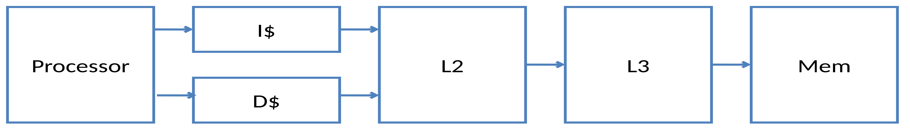
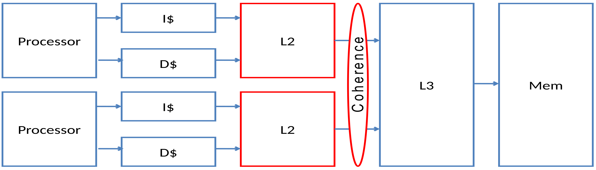
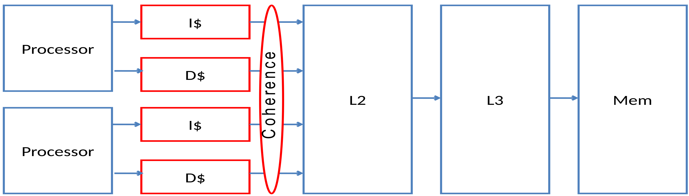
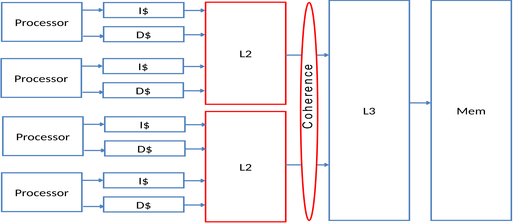
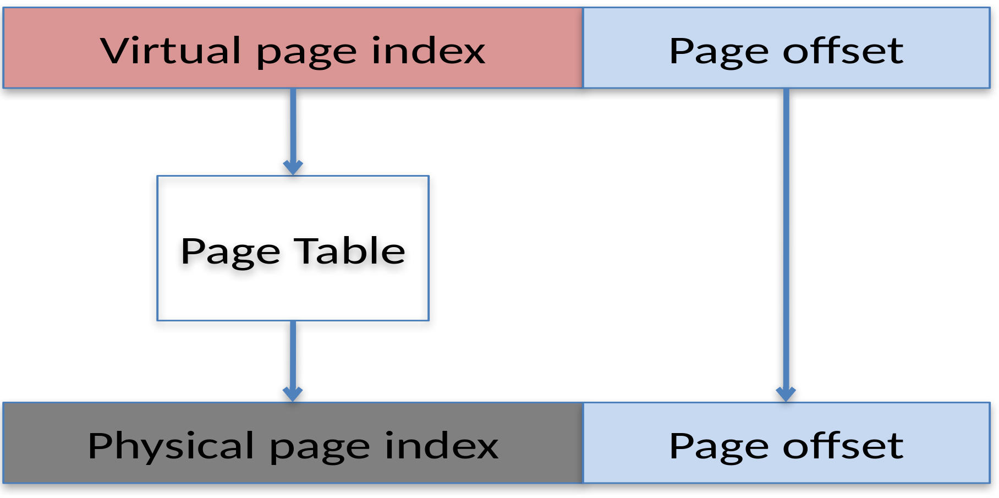
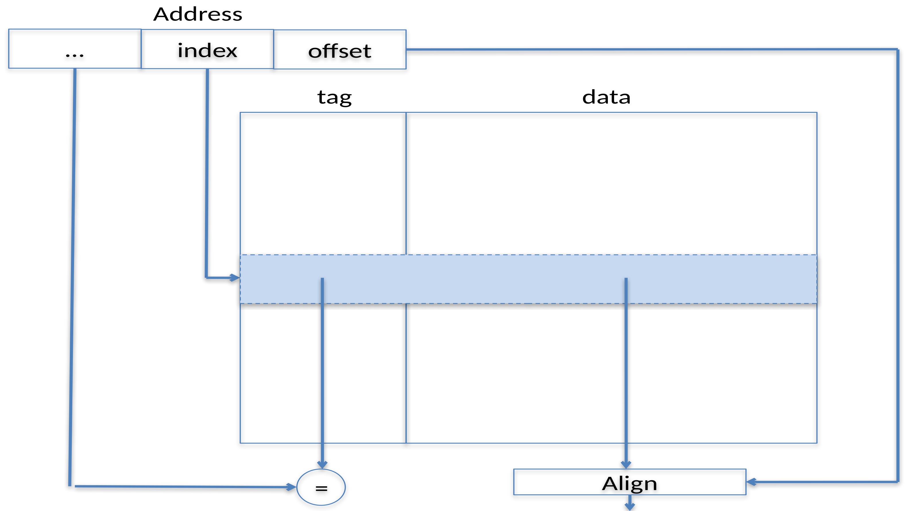
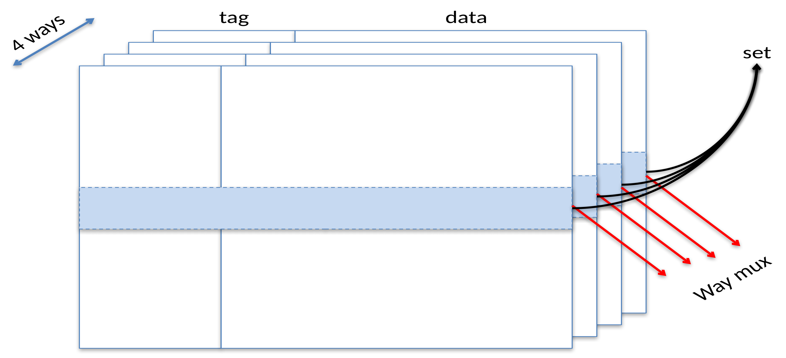
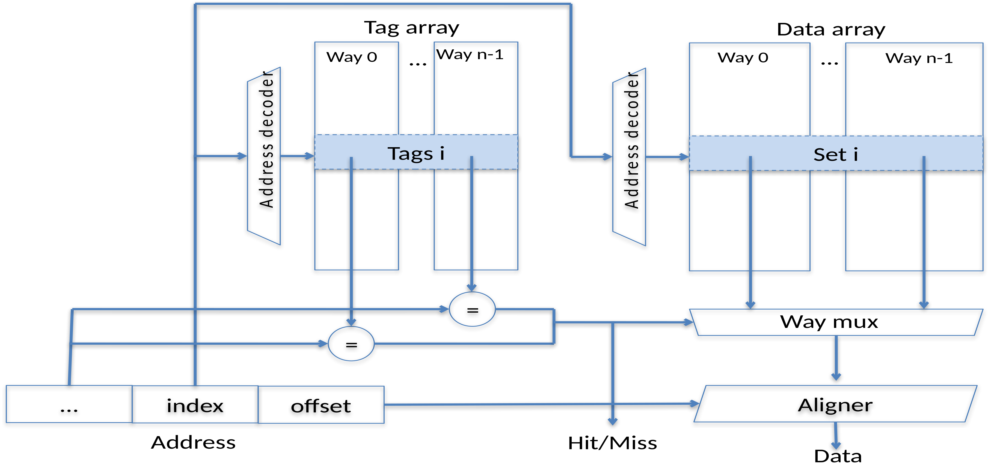
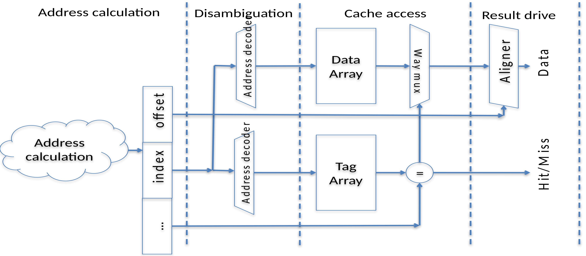
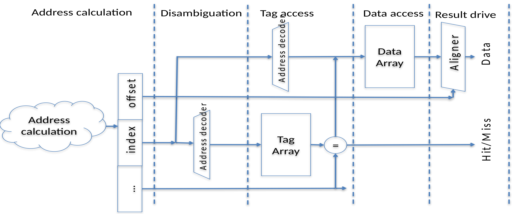

# Caches

**MO601 - Arquitetura de Computadores II**

http://www.ic.unicamp.br/~rodolfo/mo601

Rodolfo Azevedo - rodolfo@ic.unicamp.br

## Por que precisamos de cache?

* Acelera, de forma transparente, o acesso à memória
* Múltiplos níveis: L1, L2, L3
* Nível L1 dividido em dois
  * L1-I: instruções
  * L1-D: dados
* Demais níveis são unificados

## Qual o tamanho da cache em um sistema ideal?

## Organização básica

## Multi-core - surge a necessidade de coerência

## Antecipando a coerência

## Particionando a L2

## Questões importantes

* Cache inclusiva vs exclusiva
* Leituras parciais
  * Primeiro o dado que o processador precisa
  * Afeta a ordem de leitura da memória
* Write buffer
  * Atrasa a escrita na memória
  * Acelera a escrita na cache
* Write-through vs write-back  

## Memória Virtual

  * Endereço Físico
  * Endereço Virtual
  * Página
  * TLB
  * Alias virtual
  * Ordem de tradução
    * Antes da cache
    * Após a cache

## Mapeamento de endereço virtual para físico

## Estrutura interna

## Múltiplas vias (ways)

## Organização real

## Pipeline para acesso paralelo

## Pipeline para acesso serial

## Lookup-free caches

  * Suporta mais de um acesso em andamento
    * Miss Status Holding Registers (MSHR)
  * Enquanto está resolvendo um miss, executa outro acesso (Hit ou Miss)
    * Miss primário: primeiro miss em um bloco de cache
    * Miss secundário: miss subsequente em um bloco de cache
    * Stall por miss estrutural: miss extra por falta de recurso de hardware

## Outros conceitos

* Multiport
* Multibank

## Considerações sobre cache de instruções

* Multiport vs single port
* Lookup free vs blocking
* Associatividade
