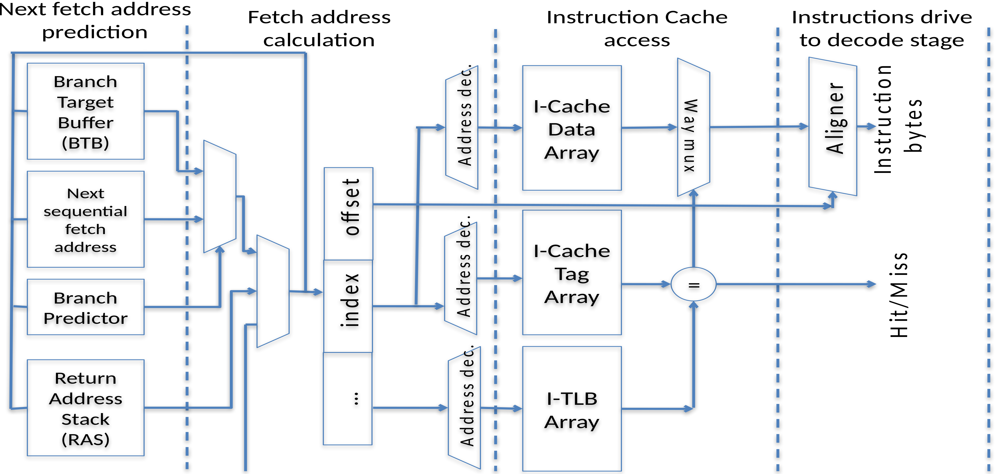
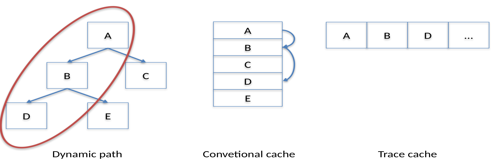
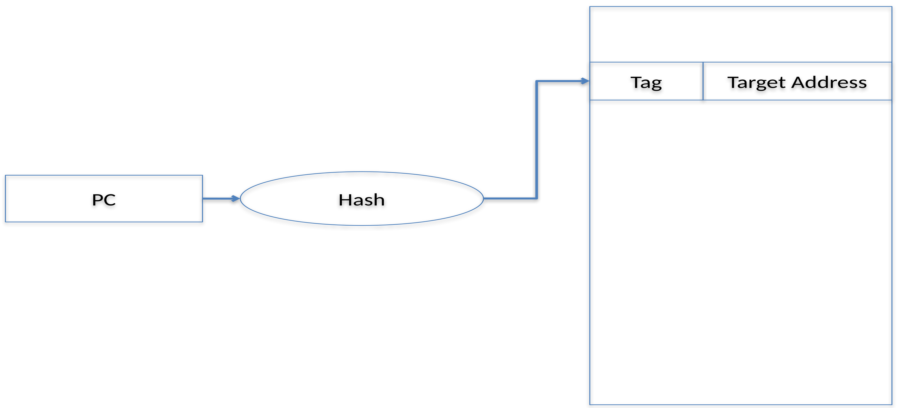

# The Instruction Fetch Unit

**MO601 - Arquitetura de Computadores II**

http://www.ic.unicamp.br/~rodolfo/mo601

Rodolfo Azevedo - rodolfo@ic.unicamp.br

## Verificando conceitos

1. Quais são os primeiros passos para executar uma instrução?
1. Descreva cenários onde você precisará de previsão de desvios (branch prediction)
1. Por que previsão de desvios?
1. Considerando um preditor de desvio como uma caixa preta, quais são as entradas e as saídas?

## Quais são os primeiros passos para executar uma instrução?
<style scoped>section { justify-content: start; }</style>

## Descreva cenários onde você precisará de previsão de desvios (branch prediction)
<style scoped>section { justify-content: start; }</style>

## Por que previsão de desvios?
<style scoped>section { justify-content: start; }</style>

## Considerando um preditor de desvio como uma caixa preta, quais são as entradas e as saídas?
<style scoped>section { justify-content: start; }</style>

## Pipeline de Fetch



## Instruction Cache



## Branch Target Buffer



## Return Address Stack

* Usa o call-trace para selecionar o endereço de retorno
* Tabela com poucas entradas
* Perte uma entrada em cada overflow
* Pode ser implementado com uma pilha

## Previsão de Saltos (Branck Predictor)

* Preditor estático
  * Utiliza um bit da codificação da instrução
* Preditor dinâmico
  * Local Predictor
  * Correlating predictor (gshare)
  * Tempo de warmup
* Preditores híbridos
* Agrupamento com a BTB

## Par ou ímpar?

```c
for (i = 0; i < 100; i++)

  if (i % 2) 

    printf("%d é ímpar\n", i);

  else

    printf("%d é par\n", i);
```

> Quantas instruções de salto tem esse trecho de código?

## Par ou ímpar?

```c
for (i = 0; i < 100; i++)

  if (i % 2)                     // salto após

    printf("%d é ímpar\n", i);   // salto após

  else

    printf("%d é par\n", i);     // salto após
```

> Quantas instruções de salto tem esse trecho de código?

## Em assembly - quantos saltos?

```mipsasm
  mov s0, zero
for:
  andi s1, s0, 1
  beq  s1, zero, else
  lui  a2, %hi(mensagem_impar)
  addi a0, a2, %lo(mensagem_impar)
  mv   a1, s1
  call printf
  j    fim_for
else:
  lui  a2, %hi(mensagem_par)
  addi a0, a2, %lo(mensagem_par)
  mv   a1, s1
  call printf
fim_for:
  addi s1, s1, 1
  li   a0, 99
  ble  s1, a0, for
```

## Em assembly - quantos saltos?

```mipsasm
  mov s0, zero
for:
  andi s1, s0, 1
  beq  s1, zero, else               # Salto
  lui  a2, %hi(mensagem_impar)
  addi a0, a2, %lo(mensagem_impar)
  mv   a1, s1
  call printf                       # Salto
  j    fim_for                      # Salto
else:
  lui  a2, %hi(mensagem_par)
  addi a0, a2, %lo(mensagem_par)
  mv   a1, s1
  call printf                       # Salto
fim_for:
  addi s1, s1, 1
  li   a0, 99
  ble  s1, a0, for                  # Salto
```


## Preditor estático
<style scoped>section { justify-content: start; }</style>

## Preditor dinâmico - 1 bit
<style scoped>section { justify-content: start; }</style>

## Preditor dinâmico - 2 bits
<style scoped>section { justify-content: start; }</style>

## Correlating predictor
<style scoped>section { justify-content: start; }</style>

