# The Decoder Unit

**MO601 - Arquitetura de Computadores II**

http://www.ic.unicamp.br/~rodolfo/mo601

Rodolfo Azevedo - rodolfo@ic.unicamp.br

## O que é necessário decodificar?

* Tipo da instrução
  * Controle, memória, aritmética, etc
* Que operação a instrução precisa executar
  * ALU
  * Verificação da condição do salto
* Que recursos são necessários
  * Registradores de entrada
  * Registradores de saída
  * Imediatos

## RISC vs CISC

| RISC | | CISC |
|:---:|:---:|:---:|
| Fixo | Tamanho da instrução | Variável |
| Poucos | Formatos de codificação| Muitos |
| Baixa | Complexidade das instruções | Alta |
| Um | Ciclos para decodificar | Vários |
| Poucos | Campos para decodificar | Muitos |

## Ainda é relevante?

* Quais as características principais?
  * Conjunto de instruções complexo vs reduzido
  * Codificação simples
  * Tamanho fixo

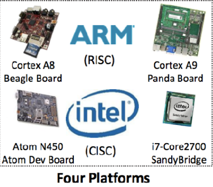 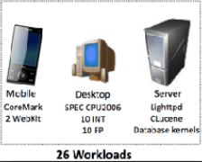 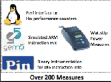 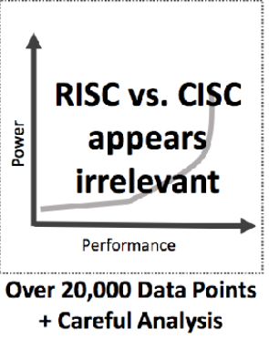

> Power Strugles, HPCA 2013.

## LDMIAEQ SP!, {R4-R7,PC}

* Lê 4 valores da memória
* Incrementa o endereço
* Escreve 5 registradores 
* Só executa se a condição EQ estiver ativa
* Escreve no PC

> **Também conhecida como ARM stack pop and return from a function**

## Características exóticas

* Branch delay slot
* Register windows
* VLIW encodings

> A experiência mostrou que elas criam problemas para implementações futuras.


## Formato de instrução do MIPS

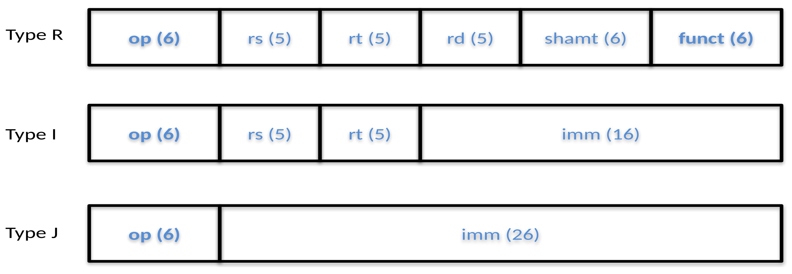

## Exercício - Decodificador do MIPS

| Instrução | Tipo | Campos |
|:---:|:---:|---|
|add|R|op = 0; funct = 32 |
|sub|R|op = 0; funct = 34 |
|addi|I|op = 8 |
|bne|I|op = 5 |
|j|J|op = 2 |


## Formato das instruções RISC-V

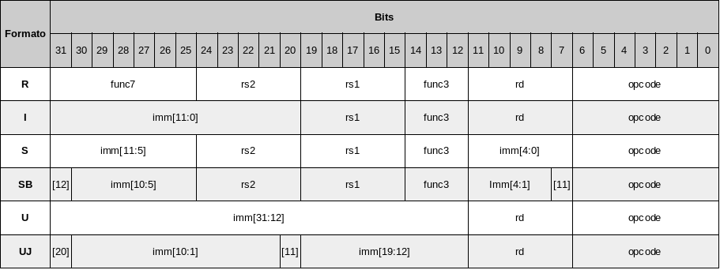

## Formato das instruções x86

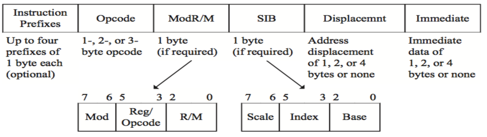


## Como decodificar uma instrução x86

* Decodificar o tamanho da instrução
* Buscar os 8 primeiros bytes
  * Até 4 bytes de prefix
  * Até 3 bytes de opcode
  * Pode existir o campo ModR/M
* Buscar os operandos
  * Podem estar codificados no opcode
  * Podem extar em bytes extras
  * Busque por ModR/M
  * Prefixos podem modificar o tamanho dos opcodes

## Como acelerar a decodificação?

* Armazenar o tamanho da instrução na cache junto com a instrução
* Utilizar múltiplos decodificadores simples e um complexo
* Converter instruções em micro-código (uop) e executar os uops ao invés das instruções
* Cache de uops

## Decodificando múltiplas instruções

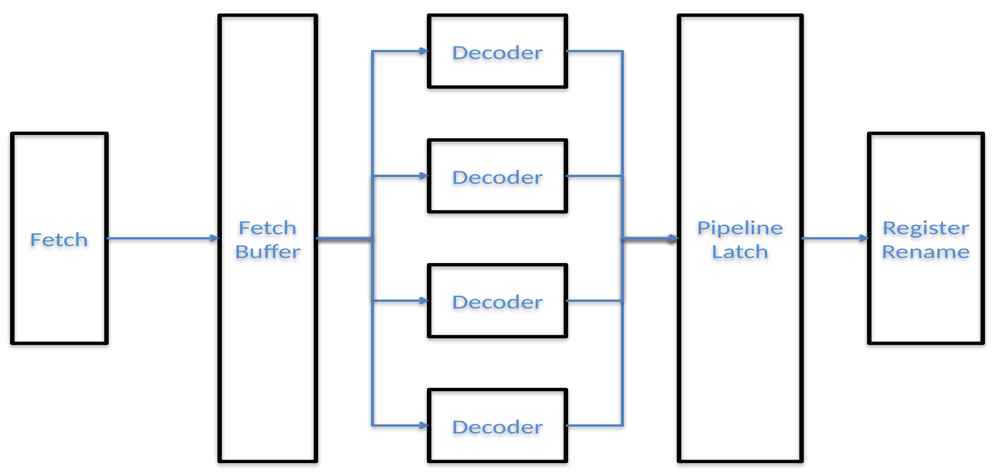

## Pipeline de decodificação do Intel Nehalem

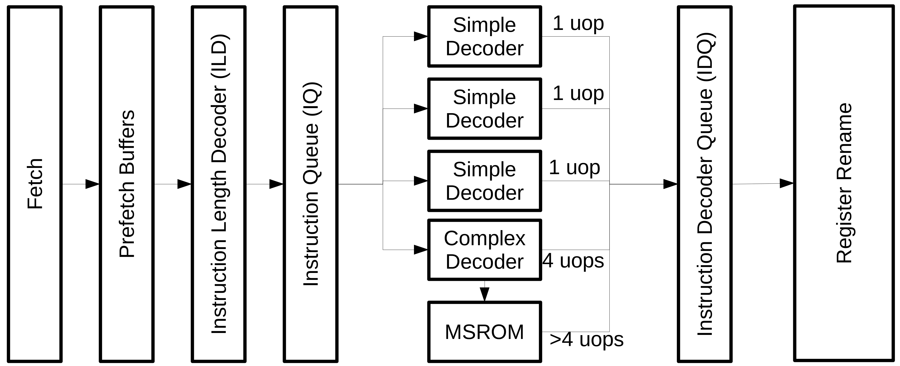

## Implementação CISC vs RISC

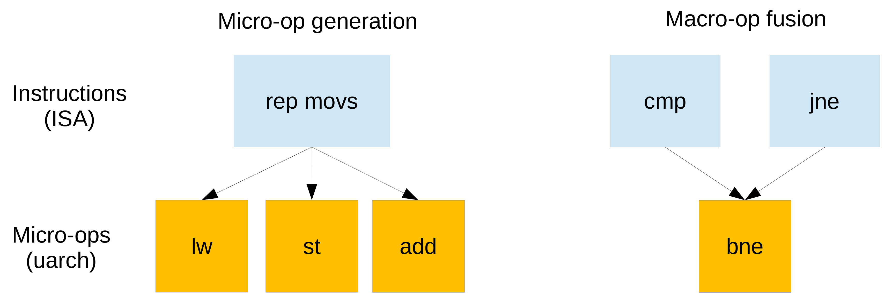

## Especificação da ISA

* É necessário ter um comportamento claro para todas as instruções
* Exemplo da especificação do ARM
  * STM (Store Multiple) armazena um conjunto não vazio (ou todos) de registradores em posições consecutivas de memória.

* Está preciso? Tem algum problema?

## Instrução STM

* Sintaxe
  * STM{<cond>}<addressing_mode> <Rn>!, <registers>
* Restrições
  * Se <Rn> for especificado em <registers> e também for especificado write-back (!)
  * Se <Rn> for o registrador de menor número especificado em <registers>, o valor original de <Rn> será armazenado
  * Caso contrário, o valor armazenado de <Rn> é UNPREDICTABLE
* Quanto ao PC
  * Quando STR ou STM utilizam R15, a instrução pode armazenar ou PC+8 ou PC+12, desde que seja consistente e sempre utilize o mesmo. A decisão é dependente de implementação

## Como verificar a implementação da ISA (um processador)

* Para as instruções especificadas, execute e verifique o comportamento!
  * Não esquecer dos efeitos colaterais (desejados ou não)
* O que fazer com instruções não especificadas?

## Como detectar instruções desconhecidas (não especificadas)?

* Toda instrução desconhecida deveria gerar um unknown instruction trap
* Para instruções de tamanho fixo (RISC ISA)
  ```
  for instruction in 0 to 2^31-1
    TestInstruction(instruction)
  ```
  * É possível pular variações de imediatos e registradores
* Para instruções de tamanho variável (CISC ISA)
  * O tamanho de uma instrução x86 vai de 1 até 16 bytes
  * $2^{128}$ é muito grande para teste individual
  * É muito grande mesmo saltando imediatos e registradores

## Processadores possuem instruções não especificadas

**Breaking the x86 instruction set, Christopher Domas, Blackhat 2017**
> *A processor is not a trusted black box for running code; on the contrary, modern x86 chips are packed full of secret instructions and hardware bugs. In this talk, we'll demonstrate how page fault analysis and some creative processor fuzzing can be used to exhaustively search the x86 instruction set and uncover the secrets buried in your chipset. We'll disclose new x86 hardware glitches, previously unknown machine instructions, ubiquitous software bugs, and flaws in enterprise hypervisors. Best of all, we'll release our sandsifter toolset, so that you can audit - and break - your own processor.*

  https://www.youtube.com/watch?v=KrksBdWcZgQ

## Como testar uma implementação x86?

* Existem inúmeros decodificadores de instruções x86 em software
  * Eles não concordam em todas as instruções!
* Para instruções documentadas, executar a instrução em um simulador (QEmu) e comparar os resultados
* Para instruções não documentadas, anotar o resultado antes e após a instrução (registradores e status)

## Como descobrir instruções não documentadas?

* Primeiramente tentar descobrir o tamanho delas
* Comece pelas menores (1 byte) e vá explorando os tamanhos
* Não é necessário explorar os múltiplos registradores
* Instruções não especificadas não geram unknown instruction trap
  * Coloque uma instrução no final de uma página e configure a próxima página como não disponível
  * Utilize page faults para detectar o tamanho das instruções

## Exemplo

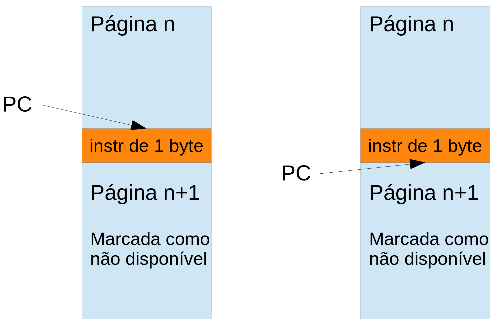

> Qual trap vai acontecer? Instrução inválida ou page fault?

## Exemplo

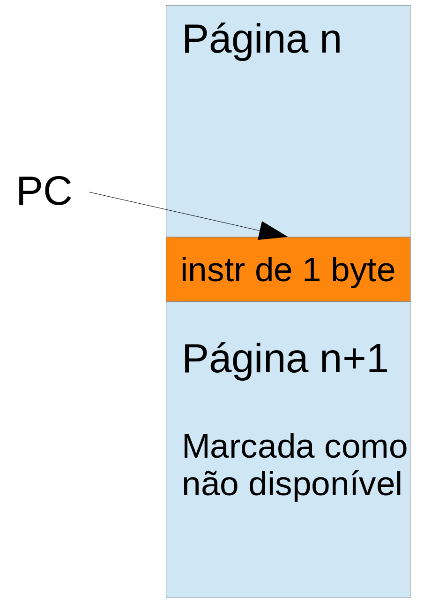

## Exemplo para 2 bytes

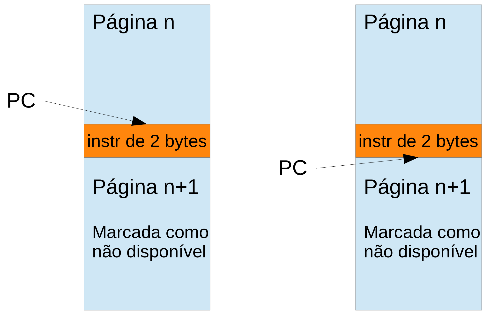

> Aumente o tamanho em bytes enquanto for indicado que aconteceu page fault

## Como verificar o comportamento?

* Dado o código
```c
main() {
  int i, v[10];
  for (i = 0; i < 10; i++)
    v[i] = i;
}
``` 
* Não importa em qual processador está executando, o programa:
  * executa 10 vezes o laço
  * escreve 10 vezes na memória
  * escreve os números de 0 até 9 na memória

> HybridVerifier. Embedded Systems Letters, 2017

## Conjuntos de instruções envelhecem

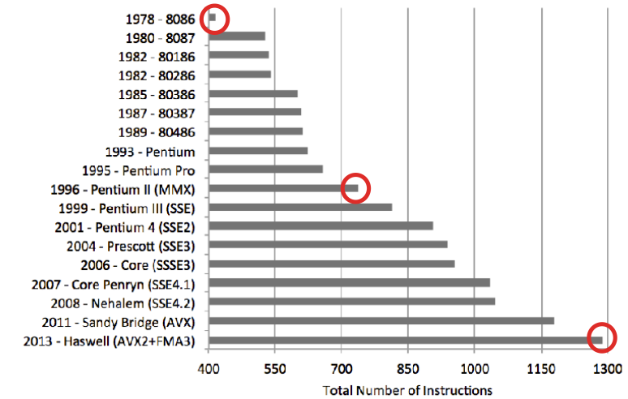

> SHRINK: Reducing the ISA complexity via instruction recycling. ISCA 2015

## Ter muitas instruções aumentam o tamanho do código

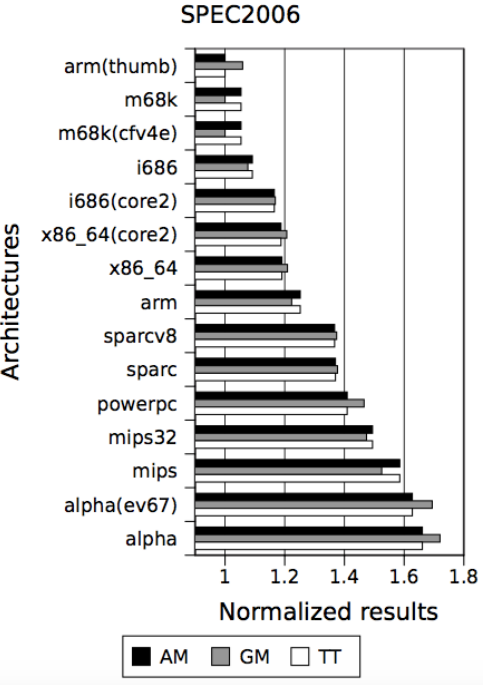

* Os mesmos programas (SPEC 2006) foram compilados para múltiplas arquiteturas
* Note que o menor código não é uma arquitetura CISC!

> Ecco, SBAC-PAD 2009
