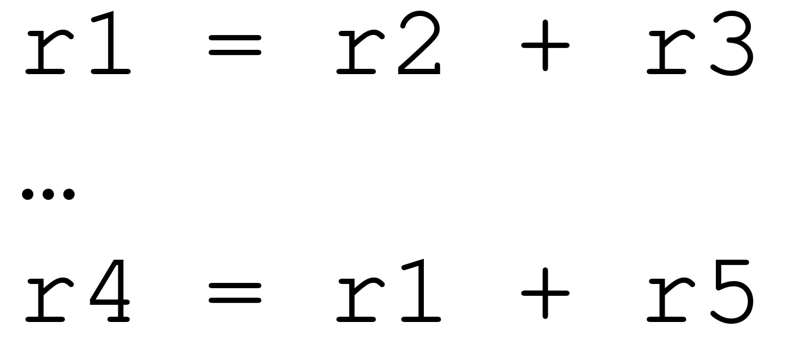
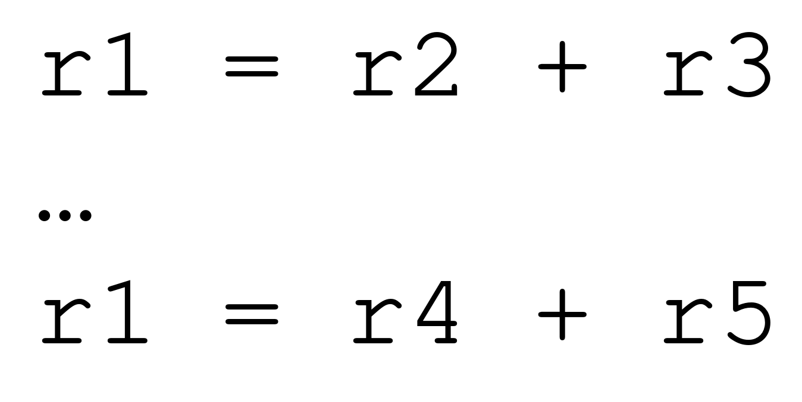
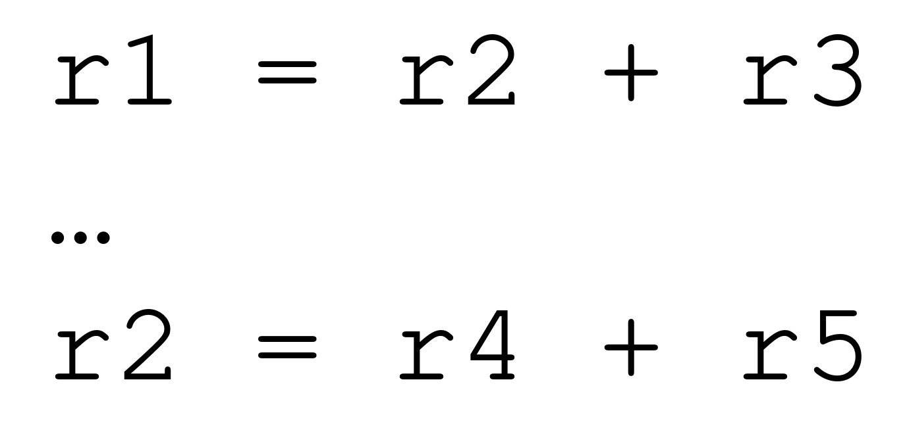
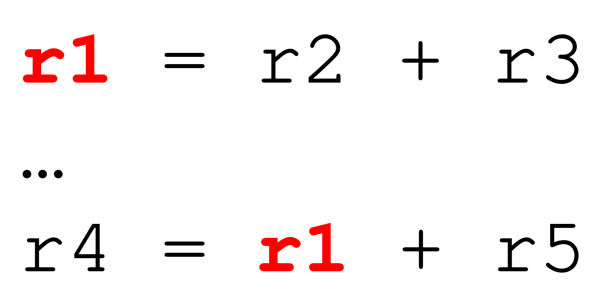
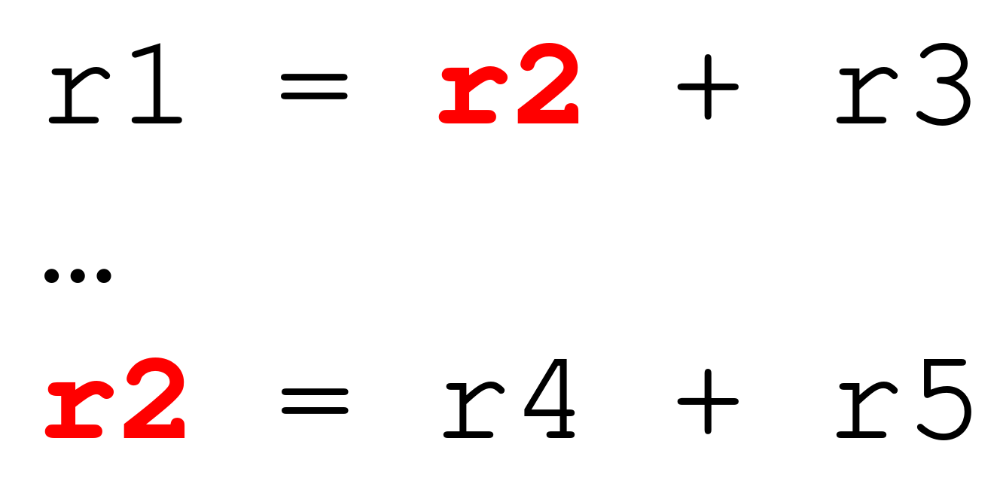
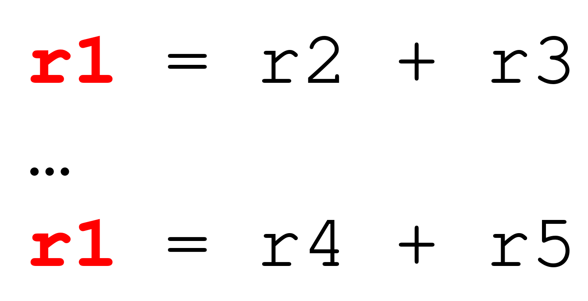
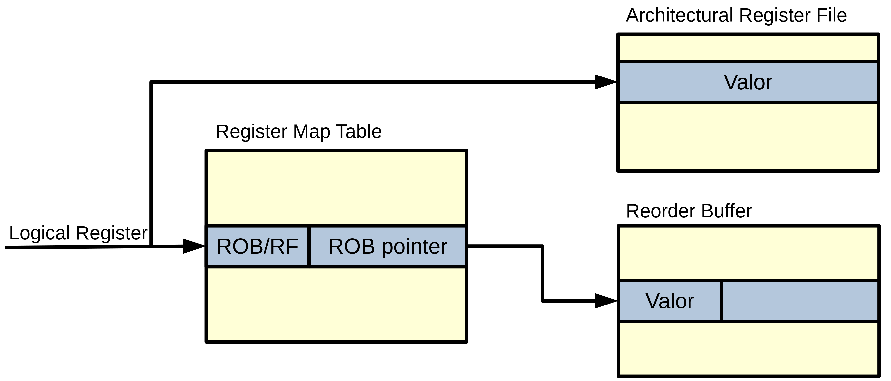
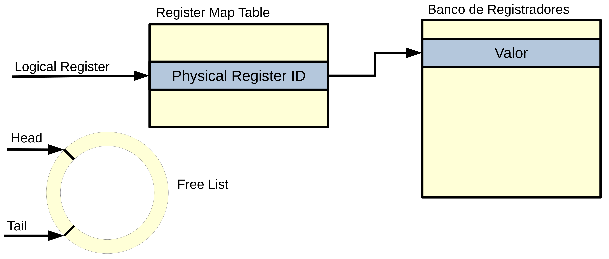

# Allocation

**MO601 - Arquitetura de Computadores II**

http://www.ic.unicamp.br/~rodolfo/mo601

Rodolfo Azevedo - rodolfo@ic.unicamp.br

## Dispatch - Despachando instruções

* Envia instruções para as respectivas unidades funcionais
* Algumas instruções podem precisar de mais de uma unidade funcional
  * Primeiro todas são reservadas
  * As instruções executam passo a passo pelas unidades necessárias
* Múltiplas unidades funcionais do mesmo tipo
  * A instrução será enfileirada numa das unidades

## Register Renaming

* Os processadores não têm registradores suficientes para todas as variáveis
* Registradores precisam ser reutilizados
* Processadores com execução fora de ordem podem executar instruções em ordens distintas
* Sempre que um novo valor é escrito num registrador, o valor antigo é perdido
* Técnica originalmente desenvolvida por Tomasulo para unidades de ponto flutuante

## Dependência de dados

###

###

## Dependência verdadeira

* O valor gravado num registrador é necessário para o uso numa instrução subsequente
* A instrução não poderá ser executada sem o valor necessário

### Read after write

## Dependência de Nomes

* O registrador é escrito após uma instrução que o lê
* A ordem das instruções não pode ser alterada
* Existe apenas um conflito de nome de registrador

### Write after write

## Dependência de Nomes

* O registrador é escrito após uma instrução que também o escreve
* A ordem das instruções não pode ser alterada
* Existe apenas um conflito de nome de registrador

### Write after write

## Register Renaming

* Utiliza registradores extras para armazenar valores extras
  * Processadores podem chegar a 100 instruções em execução simultaneamente
  * Potencialmente precisando de 100 registradores no total
* Normalmente os ISA possuem 32 registradores
* Três alternativas
  * Reorder buffer
  * Rename buffer
  * Merged register file

## Reorder Buffer

## Rename Buffer

* Variação do método anterior
* Um terço das instruções não produzem valores
* Utiliza uma estrutura separada para armazenar os valores ao invés do ROB
* O Rename Buffer pode ser menor que o ROB
  * Se uma instrução precisar de uma entrada no Rename Buffer e todas estiverem ocupadas, ela deverá aguardar (stall)

## Merged Register File

## Merged Register File

* Um único banco de registradores (grande)
  * Armazena tanto valores especulativos quanto efetivados (committed)
  * Registradores podem estar livres ou alocados
* Utiliza a free list para guardar os registradores disponíveis
* Utiliza uma tabela para mapear os registradores lógicos nos físicos
* Se não há registrador físico disponível, a instrução aguarda (stall)
* Somente libera um registrador quando outra instrução escreve nele
  * Precisa esperar até a fase de commit pois a instrução pode ser descartada

## Leitura do Banco de Registradores

* Leitura antes do despacho (Issue)
  * Nem todos os operandos estão disponíveis
  * Processa os registradores não disponíveis posteriormente através da bypass network (forwarding)
  * Poucas portas de registradores, mais valores temporários
  * Mais energia
* Leitura após o despacho
  * Armazena o id na fila de despacho (Issue)
  * Processa os operandos pelo banco de registradores e bypass network
  * Maior número de portas no banco de registradores
  * Não necessita de armazenamento intermediário

## E se a especulação falhar?

* Quando precisar descartar (squash) uma instrução
* Liberar os recursos reservados
* Reverter os registradores alocados
  * Rename tables
  * Reorder buffer
