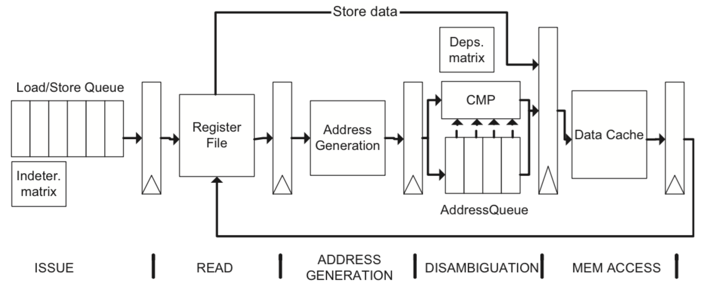

# Issue

**MO601 - Arquitetura de Computadores II**

http://www.ic.unicamp.br/~rodolfo/mo601

Rodolfo Azevedo - rodolfo@ic.unicamp.br

## Visão Geral

### Em Ordem

A instrução mais antiga, ainda não despachada, será despachada assim que seus operandos estiverem disponíveis

### Fora de Ordem
* Utilizado pela maior parte dos processadores recentes
* Instruções são despachadas assim que seus operandos estiverem disponíveis
* Podem ser baseadas em
  * Reservation stations
  * Distributed issue queues
  * Unified issue queues

## Arquiteturas em Ordem (in-order)

* Sempre considera a ordem das instruções
* Instruções despachadas tão cedo quanto seus operandos estiverem disponíveis
* A lógica de despacho normalmente contém um scoreboard e duas tabelas
  * Dependência de dados
  * Restrições de hardware

## Lógica de Despacho (issue logic)

## Fora de Ordem (out-of-order)

* Parte crítica da capacidade do processador
  * Limita o número de instruções executadas simultaneamente
* Três cenários base
  * Fila de despacho unificada (unified issue queues)
  * Fila de despacho distribuída (distributed issue queues)
  * Estações de reserva (reservation stations)

## Processo de despacho

## Estágios de pipeline

## Alocação na fila de despacho

* O estágio de Renaming (allocation) coloca novas instruções na fila de Issue (despacho)
* Se não houver espaço disponível → Stall no estágio de renaming
* Não processa instruções enquanto a fila estiver cheia
* Lê os registradores e define os bits de disponibilidade

 ## Wake up

* Avisa que um operando foi produzido
* Indentifica o renaming Id e o bit de válido
* A instrução se torna disponível quando os dois operandos de origem têm seus bits de pronto (ready) ativados
* Quando um valor é produzido mas não consumido (instrução não está na fila), o valor é armazenado em algum outro lugar (ROB, banco de registradores, etc)

## Early wake up

## Early wake up (antecipado)

## Wake up antecipado

* Pode ser gerado quando sabemos o tempo que uma instrução vai precisar
* Como no slide anterior, pode ser antecipado em 3 ciclos
* Para instruções de load, não é possível prever a latência de memória
  * Aguarda até o final do load para acordar a instrução consumidora
  * Ou acorda especulativamente

## Seleção de instrução

* Seleciona a próxima instrução a ser executada
  * Precisa de todos os registradores de origem disponíveis
  * Precisa de todos os recursos de hardware disponíveis
* Normalmente dividido entre árbitros ou escalonadores
  * Ao invés de despachar 4 instruções, utilizar 2 árbitros para despachar 2 instruções cada
  * Instruções são distribuídas para diferentes árbitros
  * Cada árbitro é responsável por um subconjunto de instruções e  unidades funcionais

## Lógica de seleção (baseado no Alpha 21264)

## Entry reclamation

* Libera a fila de instrução após o despacho da instrução
* A liberação pode ser adiada se o processador estiver acordando (wakeup) instruções especulativamente

## Processo de despacho

## Pipeline

## Redução de portas de leitura

* Leituras após despacho (issue) podem exigir mais portas de leitura
  * Largura da máquina vs largura de issue
* Alguns processadores (Alpha) dividem o banco de registradores e o número de portas
* Muitos dos valores de entrada são lidos do bypass network ao invés do banco de registradores
* Redução de portas ativa
  * Sincroniza os árbitros para usar menos portas de leitura
* Redução de portas reativa
  * Cancela instruções se o número de leitura for maior que o de portas disponíveis
* Ambos exigem uma poítica justa para fazer o cancelamento

## Fila de despacho distribuída

* Processadores distribuem as unidades funcionais em blocos (clusters) de unidades funcionais
* Cada bloco possui sua fila própria
* Pentium 4 tem 2 blocos de unidades funcionais
  * Operações de memória
  * Operações que não são de memória

## Estações de reserva

* Buffers por unidade funcional
* Armazena instruções e suas entradas
* Recebem instruções imediatamente após renaming
* As instruções divulgam os resultados para todas as estações de reserva (reservation stations)
* Quando os operandos de origem de uma instrução estiverem disponíveis, ela pode ser executada

## Operações de memória

* Dependências através da memória não são resolvidas por renaming
* Memory disambiguation → Resolve as dependências de memória
* Nonspeculative disambiguation
  * Aguarda para ter certeza que não há dependência de memória com a operação anterior
* Speculative disambiguation
  * Tenta prever as dependências entre as operações de memória
30% das instruções são operações de memória

## Memory disambiguation

|||
|----|-----------|
|Total ordering|All memory accesses are processed in order|
|Partial ordering|All stores are processed in order, but loads execute out of order as long as all previous stores have computed their address|
|Load & Store ordering|Execution between loads and stores is out of order, but all loads execute in order among them, and all stores execute in order among them|
|Store ordering|Stores execute in order, but loads execute completely out of order (Speculative)|

## AMD K6 (Load Ordering and store ordering)

## AMD K6

* Load queue
  * Mantém os loads na ordem do programa
  * Load fica na fila até que seja o mais velho e seus operandos estejam prontos
* Address generation
  * Calcula o endereço das operações de memória
* Store queue
  * Mantém as operações de store na ordem do programa
  * Store fica na fila até que seja o mais velho e seus operandos estejam prontos
* Store buffer
  * Mantém as operações de store até que sejam as mais velhas em execução no processador

## MIPS R10000 (Partial ordering)

## MIPS R10000

* Load/store queue
  * 16 entradas
  * Instruções aguardam até que os operandos estejam prontos
* Indetermination matrix
  * Utilizada para anotar quando o endereço da instrução é computado
* Dependency matrix
  * Armazena as dependências entre operações de memória
* Address generation
  * Calcula o endereço de memória
* Address queue
  * Contém os endereços dos loads e stores que querem acessar a cache

## Speculative memory disambiguation

## Alpha 21264

* Load/Store Queue
  * Guarda as operações de memória até que os operandos estejam prontos
* Load Queue
  * Armazena endereços físicos dos loads na ordem do programa
* Store Queue
  * Armazena endereços físicos dos stores e os seus dados na ordem do programa
* Wait Table
  * Rastreia os loads para detectar quando eles violam dependências
  * Também rastreia os loads anteriores que causaram dependências para que eles não sejam despachados antes do store que eles dependem

## Speculative Wake up of load consumers

* Loads gastarão algum tempo para acordar (wakeup) a próxima instrução
* Muitas das vezes, os loads acessam a cache e geram hit
* É possível acordar a próxima instrução especulativamente e tratar o cache miss com rollback
  * Cancelando a instrução
  * Despachando novamente
* Alternativas
  * Manter a instrução na fila de despacho
  * Criar estruturas adicionais para gerenciar estas instruções

## Speculative wake up of load consumers

