# Execute

**MO601 - Arquitetura de Computadores II**

http://www.ic.unicamp.br/~rodolfo/mo601

Rodolfo Azevedo - rodolfo@ic.unicamp.br

## Unidades de execução

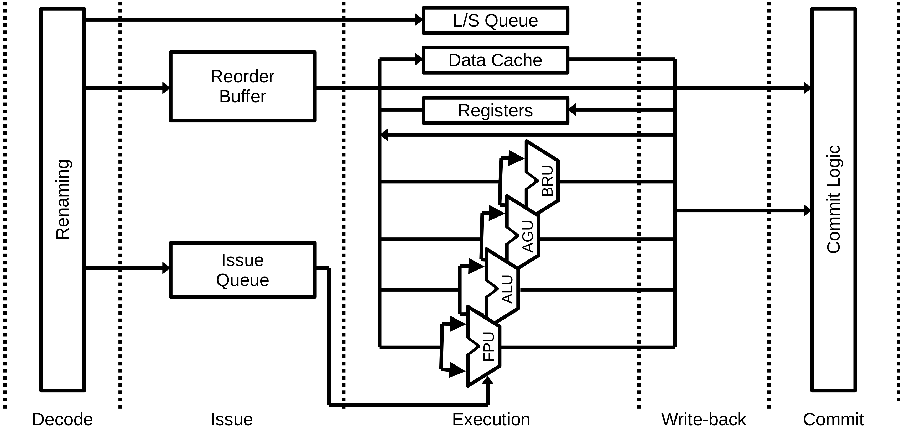

## Unidades de execução

* ALU: Arithmetic and Logical units
* FPU: Floating-point units
* AGU: Address Generation units
* BRU: Branch units
* LSU: Load/Store units

## ALU - Arithmetic and logical units

* Executam operações aritméticas e lógicas
  * Soma, subtração
  * AND, OR, NOT, XOR, NAND, NOR, XNOR
  * Deslocamento, rotação, troca de bytes
* Flags (códigos de condição)
  * Para x86: sign, parity, adjust, zero, overflow, and carry
  * Normalmente gerados em conjunto com cada computação

## Multiplicação e divisão de inteiros

* Pode ser integrada na ALU convencional
* Alternativamente, pode ser implementada
  * Convertendo inteiro para ponto-flutuante
  * Realizando a operação de ponto-flutuante
  * Convertendo o resultado de volta
  * Economiza energia e área ao custo de maior latência
* Cada operação pode ter uma latência diferente que precisa ser tratada

## AGU - Address generation unit

* Converte os operandos em endereço de memória
* Modelo de memória linear
  * Um único espaço de endereço contínuo
  * Linear (flat)
* Modelo de memória segmentado
  * Múltiplos espaços de endereçamento independentes
  * Base do segmento + offset
* O resultado é chamado de endereço efetivo

## AGU do x86

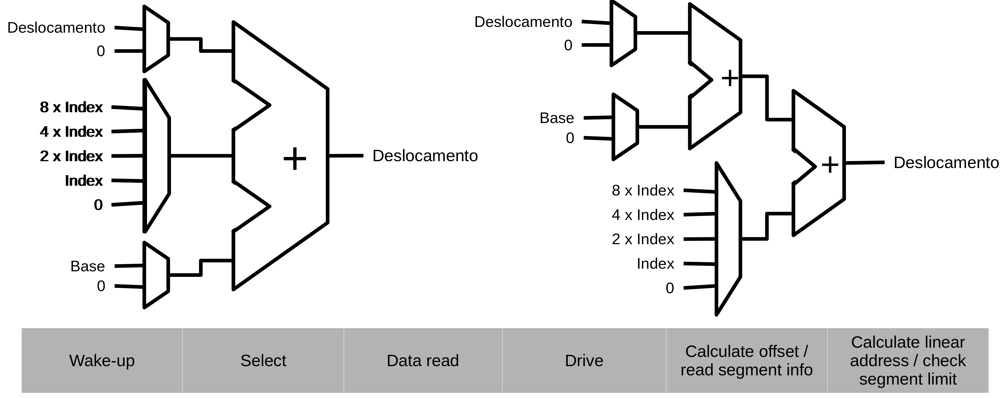

## BRU - Branch unit

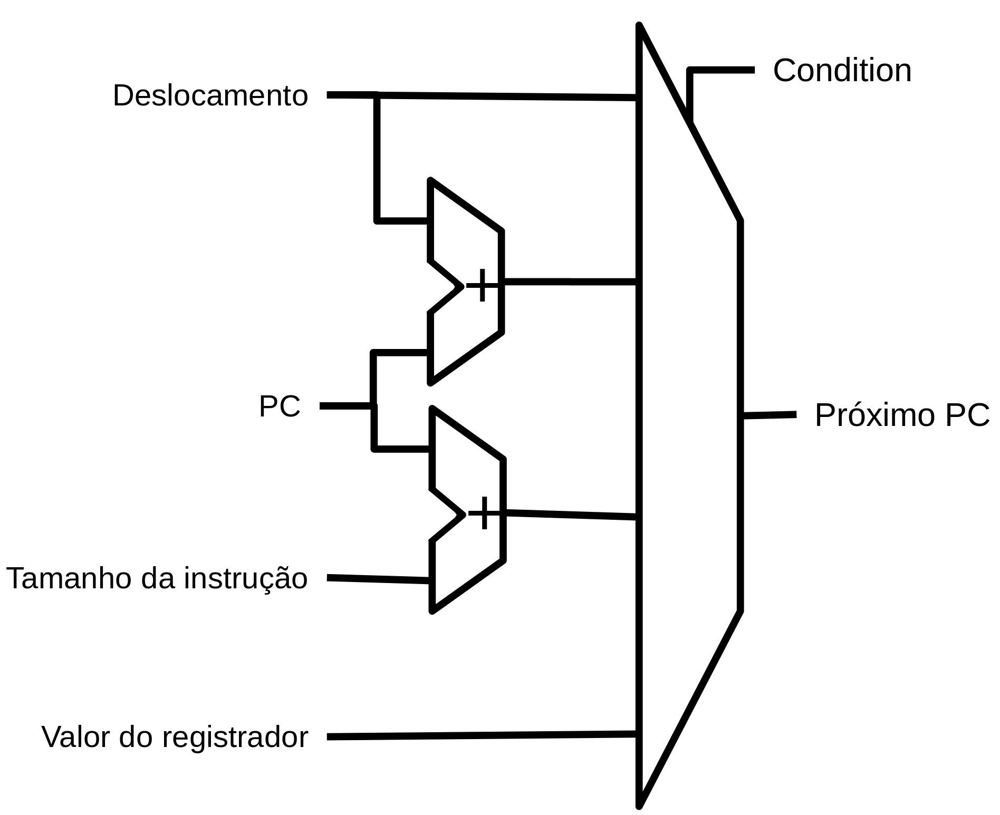

* Direto Absoluto
  * A instrução define o próximo valor de PC explicitamente
* Direto relativo ao PC
  * Adiciona um offset para criar o novo PC
* Indireto
  * Utiliza um registrador

## FPU - Floating-point unit

* Executa operações aritméticas em números de ponto-flutuante
* Unidade bastante complexa e grande
* Utiliza banco de registradores separados. Normalmente existem instruções para mover registradores de um banco para o outro
* IEEE 754 especifica 5 formatos
  * Half precision (16 bits)
  * Single precision (32 bits)
  * Double precision (64 bits)
  * Quadruple precision (128 bits)
  * Octuple precision (256 bits)
* Intel também utiliza: Single-extended precision (>= 43 bits) e Double-extended precision (>= 79 bits)

## SIMD

* Single Instruction Multiple Data
* Opera em registradores SIMD
* No passado eram conhecidas como máquinas vetoriais
  * Vetores com centenas/milhares de elementos de/para memória
* Atualmente operam com vetores menores
* Extensões SIMD
  * x86 MMX, SSE, AVX

## Unidade SIMD

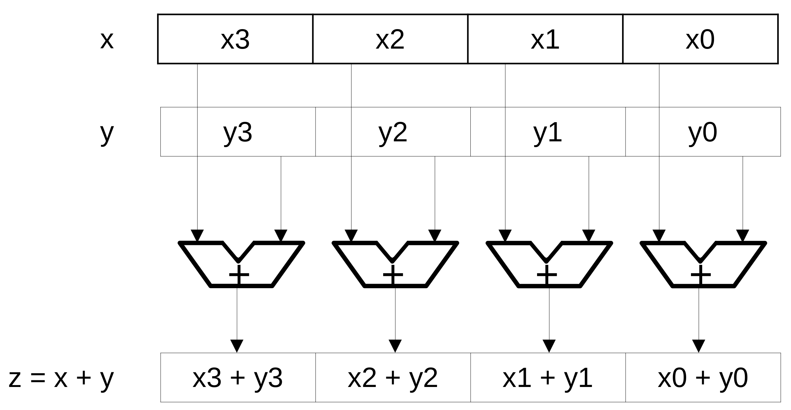

## Operandos para registradores de 128 bits

* 16 bytes
* 8 palavras (16 bits)
* 4 palavras duplas (32 bits)
* 2 palavras quádruplas (64 bits)
* 4 single-precision FP (32 bits)
* 2 double-precision FP (64 bits)

## Implementação

* Para reduzir o tamanho do hardware, o processador pode ter trilhas
  * Uma trilha: executa todas as operações de uma só vez
  * Duas trilhas: separa as operações em dois ciclos (dobro do tempo)
* Operações diferentes podem ter configurações diferentes de trilhas

## Bypassing de resultados

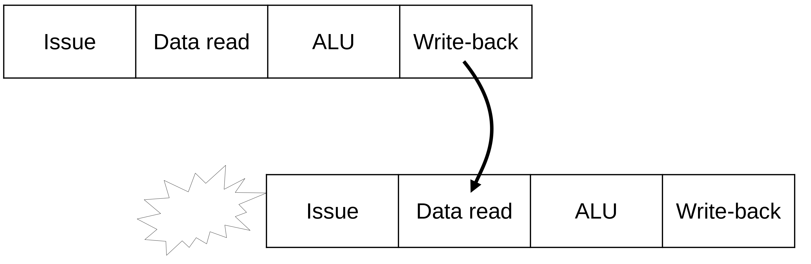

## Bypassing

* Resultados de uma computação podem ser utilizados especulativamente antes antes do estágio de write-back
* Write-back e Data read podem compartilhar estruturas em vários processadores
* Quanto maior o pipeline (maior frequência), maior é o custo de esperar instruções
* O compilador pode ajudar intercalando instruções
* Pipelines em ordem (in-order) sofrem mais que fora de ordem (out-of-order)

## Processador com pipeline profundo

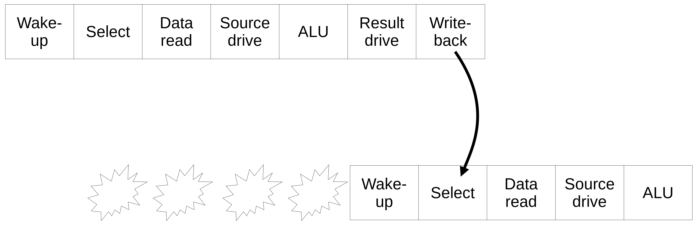

## Melhorando o desempenho

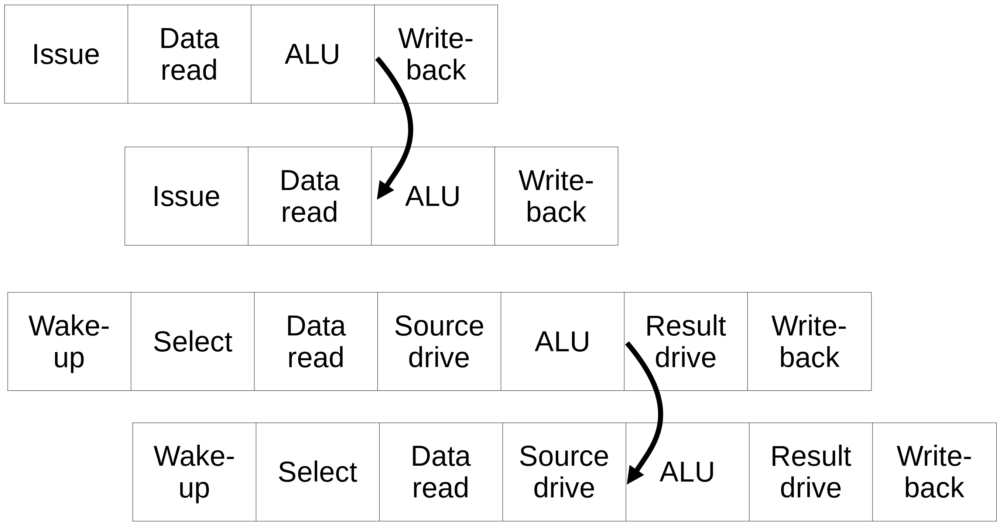

## Complexidade do bypassing

* O número de linhas de bypass aumenta com o número de origens e destinos
* Esse aumento afeta a área, consumo de energia, caminho crítico e layout físico
* Pode melhorar o IPC mas afetar a frequência
* Algumas implementações reduzem a rede de bypass como um tradeoff ao invés de usar uma rede completa de bypass 

## Implementação básica

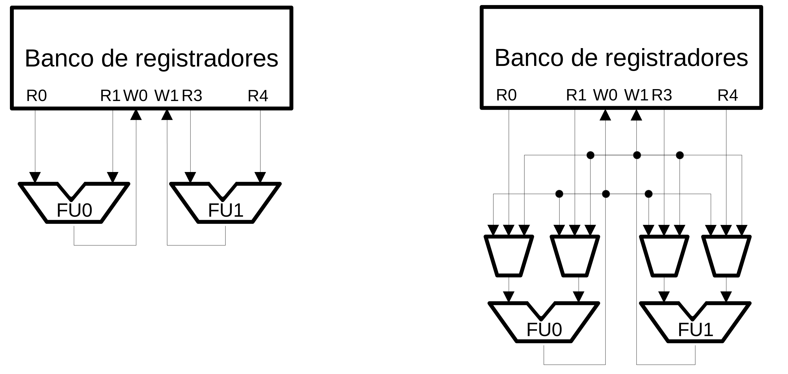

## Pipeline profundo e bypass

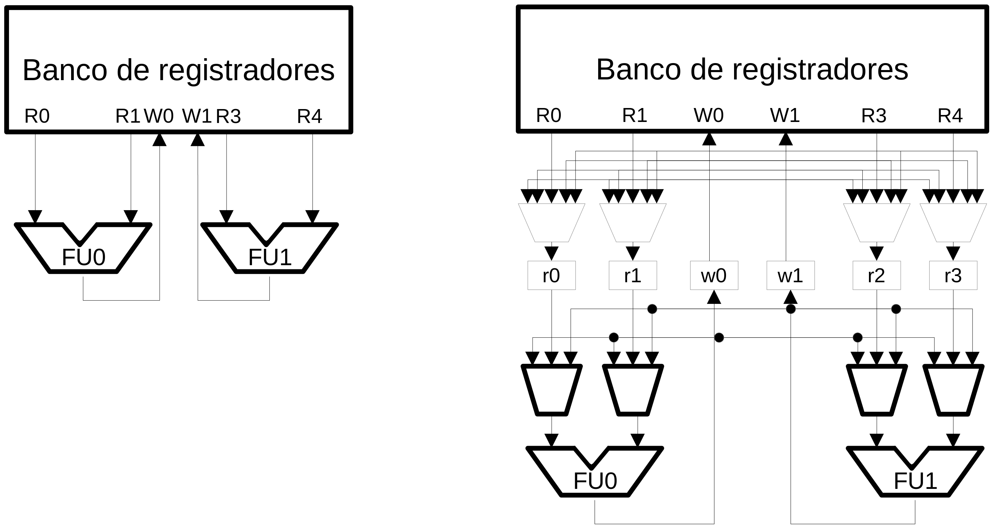

## Bypass no pipeline

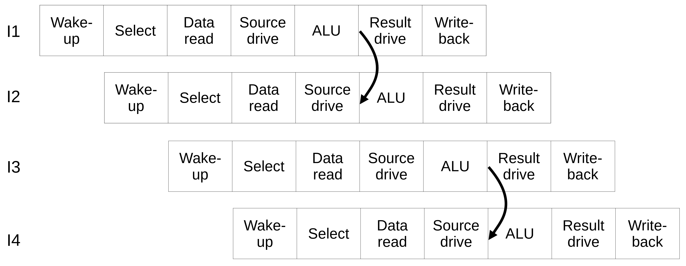

## Processadores In-Order

* Restrições de temporização permitem que algumas instruções terminem antes de outras, fazendo com que tenham que esperar muitos ciclos
  * Os resultados são guardados em latches extras no pipeline
  * São necessárias estruturas de bypass vindas desses latches para todas as unidades funcionais
* A complexidade pode ser maior que em certos processadores out-of-order

## Pipeline possível para o Intel Atom

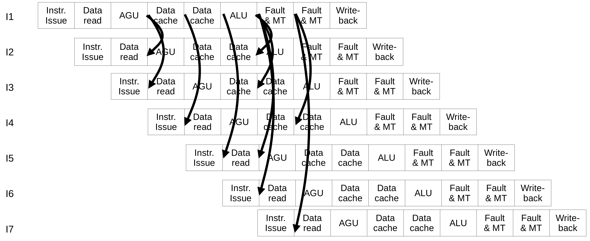

## Complexidade

* Os processadores in-order precisarão de muitos latches (staging registers)
* Cada valor terá que andar pelo pipeline
* Como alternativa, é possível criar um banco de registradores para esses valores
  * Técnica similar ao ROB para dados
* É difícil, em processadores modernos, fornecer bypass de todas as unidades funcionais para todas as outras
  * A rede de bypass fica muito grande
  * Nem todas as unidades funcionais compartilham bypass: FPU, SIMD

## Clustering

* As arquiteturas evoluiram e aumentaram a complexidade
* Potência, temperatura e interligação restrigem o crescimento do processador
* Uma forma efetiva para minimizar esse problema é particionar o hardware
  * Replicar arrays na cache
  * Dividir o banco de registradores, issue queues e  rede de bypass

## Clustering the bypass network

* Restringe quais UFs podem receber dados de outras UFs
* A forma mais simples é permitir apenas a UFx receber dados da UFx
* Essa técnica pode reduzir um estágio do pipeline
  * Em processadores complexos, bypass pode usar um estágio de pipeline exclusivo

## Clustering the bypass network

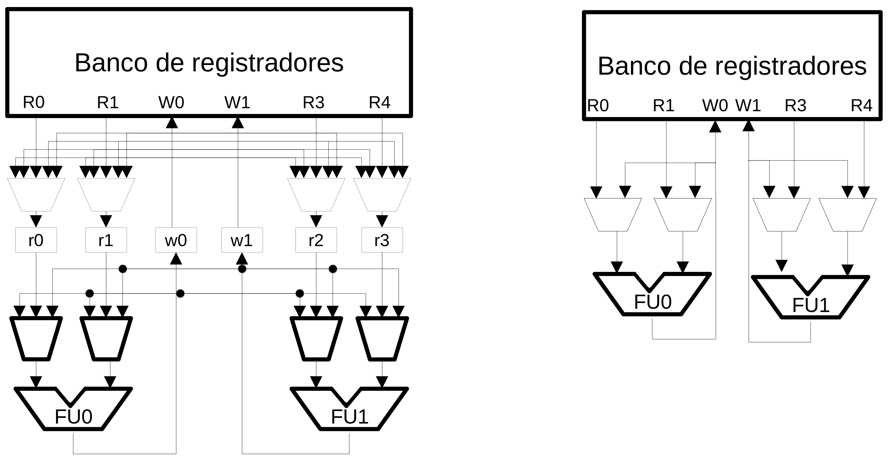

## Clustering com replicação no banco de registradores

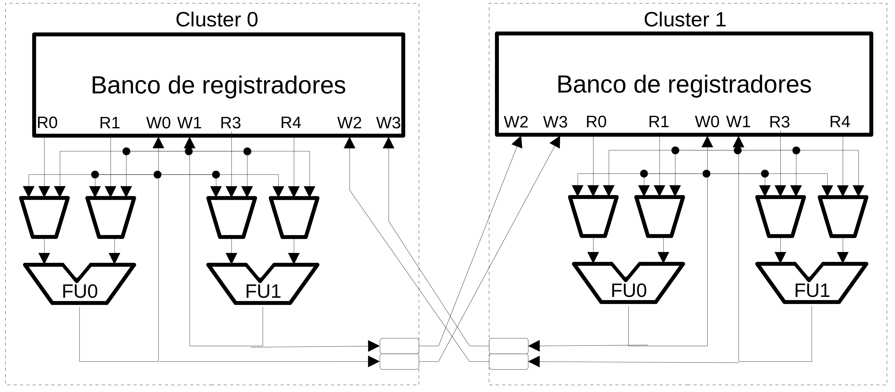

## Clustering com fila de despacho e banco de registradores distribuídos

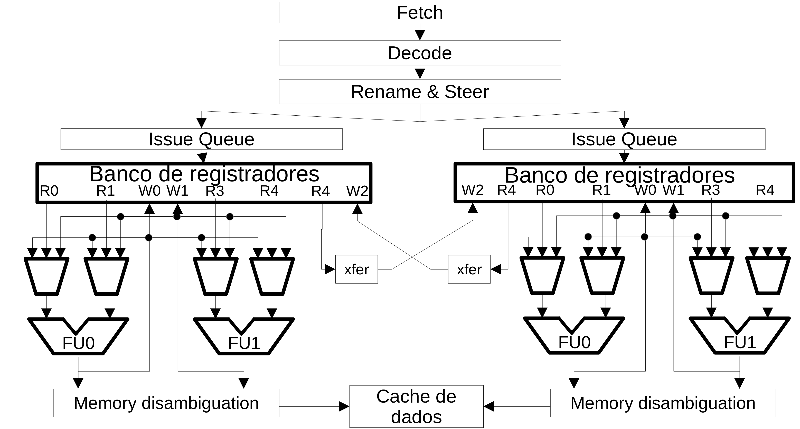

