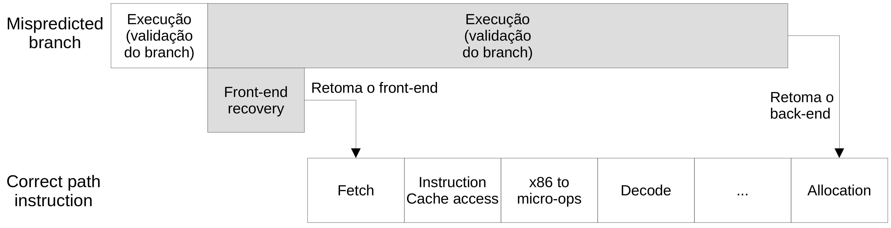

# Commit

**MO601 - Arquitetura de Computadores II**

http://www.ic.unicamp.br/~rodolfo/mo601

Rodolfo Azevedo - rodolfo@ic.unicamp.br

## Por que mais um estágio?

* Ambos processadores, em ordem e fora de ordem, podem ter instruções alcançando o estágio de write-back fora da ordem correta
* Processadores precisam tratar exceções
* Processadores precisam tratar falhas de predição de branches
* O estágio de commit é responsável por resolver esses problemas

## Estado do processador

* Estado arquitetural
  * Valores de memória e registradores internos
  * Todos os registradores devem ser acessados e visíveis a todo o processador (valores confirmado)
* Estado especulativo
  * Dados precisam ser utilizados com cuidado (especulativamente)
  * Dados especulativos precisam ser rastreados pelo processador
  * O processador deve ser capaz de desfazer os estados especulativos e suas consequências
  * Commit do estado especulativo → Novo estado arquitetural

## RISC vs CISC

* Instruções CISC são quebradas em micro-operações
* Em geral, as micro-operações precisam fazer commit juntas
  * Existem algumas exceções, como as instruções de cópia de memória do x86

## Liberação dos Recursos

* As entradas do Reorder Buffer (ROB) e Memory Order Buffer (MOB) podem ser liberadas no momento do commit
* Registradores físicos podem ser liberados se não forem utilizados novamente

## Tratamento dos Estados Arquiteturais

* Os valores dos stores só podem ser gravados na memória no estágio de commit
  * Loads precisam checar o store buffer
* Duas técnicas para rastrear o estado arquitetural
  * Reorder Buffer (ROB) e Retire Register File (RRF)
  * Merged Register File (MRF)

## Retire Register File (RRF)

## Retire Register File em ação

## Merged Register File

* Banco de registrador que armazena estados arquiteturais e especulativos
* Precisa rastrear os valores especulativos
* Valores não são movidos de um lugar para o outro
* Melhor para processadores cujas instruções leem os operandos após o despacho (issue)
* Esquema centralizado vs descentralizado
  * ROB
  * MRF
  * Múltiplos pipelines

## Recuperação

* Certifique-se de que a instrução que gerou exceção não é especulativa
* Duas tarefas distintas
  * Recuperação do front-end
    * Limpar os buffers intermediários
    * Restaurar o histórico do preditor de branch
    * Atualizar o PC
  * Recuperação do back-end
    * Remover todas as instruções especulativas
    * Restaurar a renaming table
    * Recuperar os estados arquiteturais

## Pipeline para recuperar branches

## Tratando as falhas de predição

* Para arquiteturas com ROB e RRF
  * Aguardar o branch chegar no estágio de commit
  * Utilizar o RRF para restaurar o estado arquitetural (renaming table)
* Merged Register File
  * Utilizar um log para detetar os valores especulativos
  * Toma tempo mas pode ser otimizado
  * Ajustar a renaming table e os identificadores dos registradores físicos

## Exceções

* Exceções precisas vs imprecisas
* Aguardar até o estágio de commit
  * Garante que a instrução não é especulativa
* Todos os estados arquiteturais estão estáveis agora
* Descartar (flush) todas as instruções em andamento
* Recuperar o estado arquitetural
* Redirecionar o front-end para o tratador de exceções
