# Coerência de Cache

**MO601 - Arquitetura de Computadores II**

http://www.ic.unicamp.br/~rodolfo/mo601

Rodolfo Azevedo - rodolfo@ic.unicamp.br

## Por que precisamos de coerência de cache?

* Diferentes cores escrevem e leem dados da memória
* Dados são armazenados temporariamente na hierarquia de cache
* É importante que todas as leituras recebam o valor mais atualizado

## Exemplos de hierarquia multicore

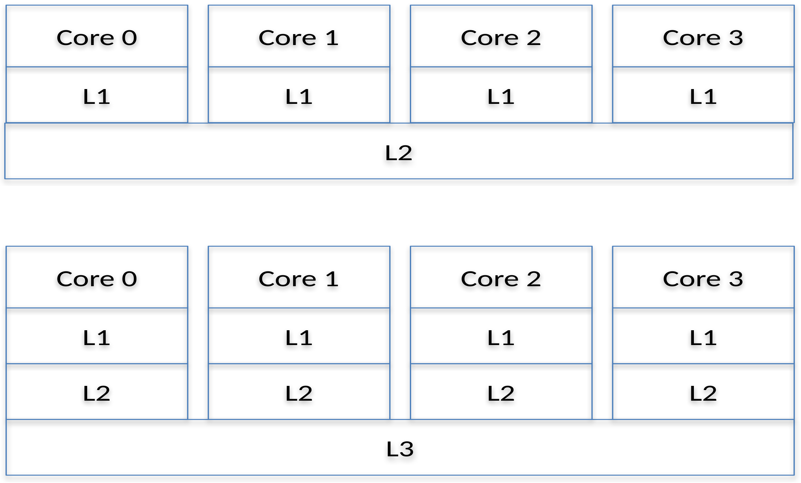

## Conceitos básicos

* **Cache inclusiva**: Contém todos os valores dos níveis menores
  * Uma cache L2 inclusiva contém todos os dados de todas as L1 conectadas a ela
  * Se for necessário remover um dado dessa L2 (*evict), o dado também será removido da L1
* **Compartilhamento falso**: Duas caches editando partes distintas de um mesmo bloco
* **Coerência**: Todos os acessos a um mesmo bloco são visto na mesma ordem
* **Consisência**: Todos os acessos a blocos diferentes são vistos na mesma ordem

## Protocolos

* **Snooping**: As caches espionam todas as transações do barramento e tomam atitudes
* **Baseado em diretório**: Utiliza uma localização central para rastrear todos os blocos de cache

> Protocolos de diretório são mais escaláveis, embora mais complexos

## Protocolo MSI

* **M**odified: um bloco de cache contém uma nova versão do dado
  * Apenas um bloco de cache pode estar nesse estado
* **S**hared: um bloco de cache contém uma versão do dado que pode ser compartilhado
  * Mais de um bloco de cache pode estar nesse estado
* **I**nvalid: um bloco de cache não contém uma versão do dado ou a versão não é válida

## Protocolo MSI em snooping em ação

Considerando uma cache com:

* Bloco de 16 bytes
* Protocolo MSI
* Snooping
* Valores de memória $M[i]=10i$
* Sistema com 4 cores, L1 privada, L2 compartilhada
* Barramento de snooping entre L1 e L2

## Diagrama do sistema

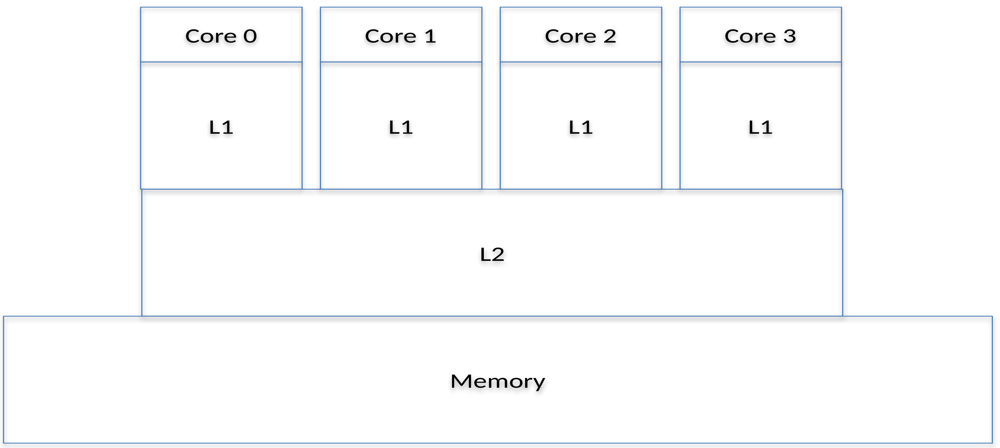

## C0: READ(0);

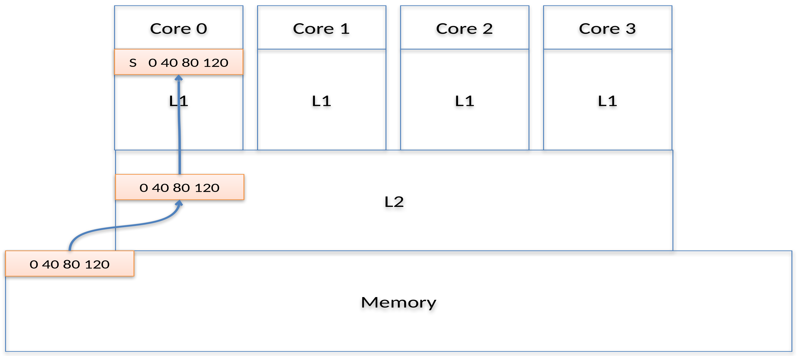

## C0: READ(0); C1: READ(0);

## C0: READ(0); C1: READ(0); C2: READ(0); C3: READ(0);

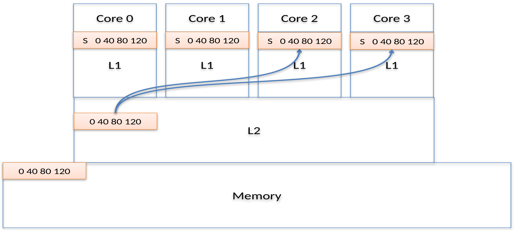

## C1: READ(16);

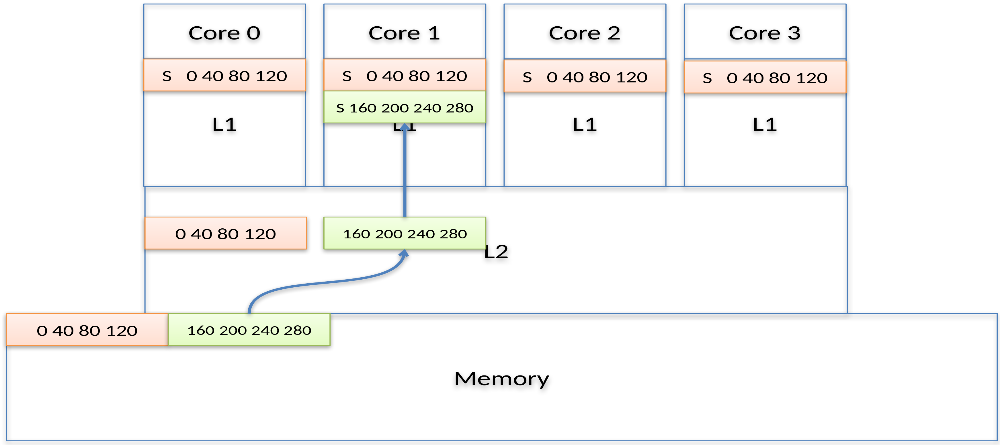

## C1: READ(16); C2: WRITE(0, 5);

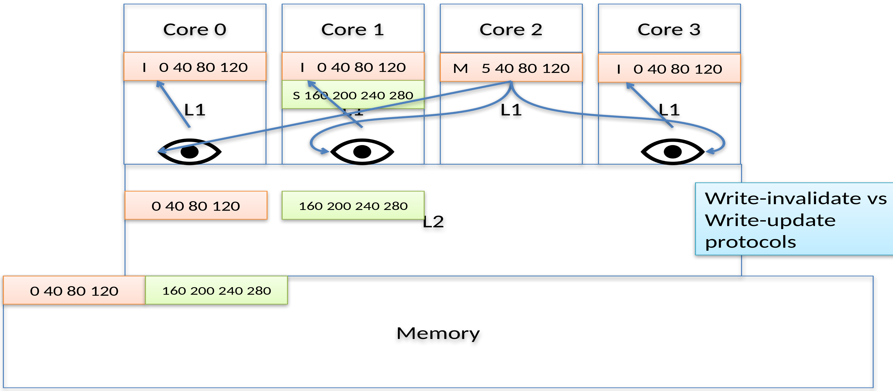

## C1: READ(16); C2: WRITE(0, 5); C1: WRITE(16, 0)

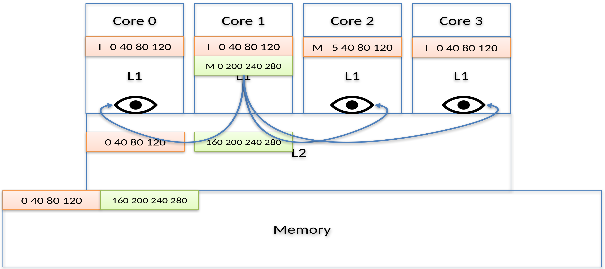

## C1: READ(16); C2: WRITE(0, 5); C1: WRITE(16, 0); C3: READ(16);

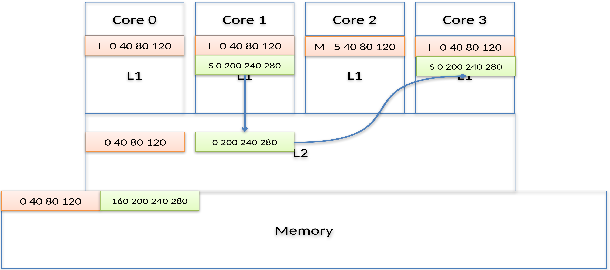

## C0: WRITE(8, 0);

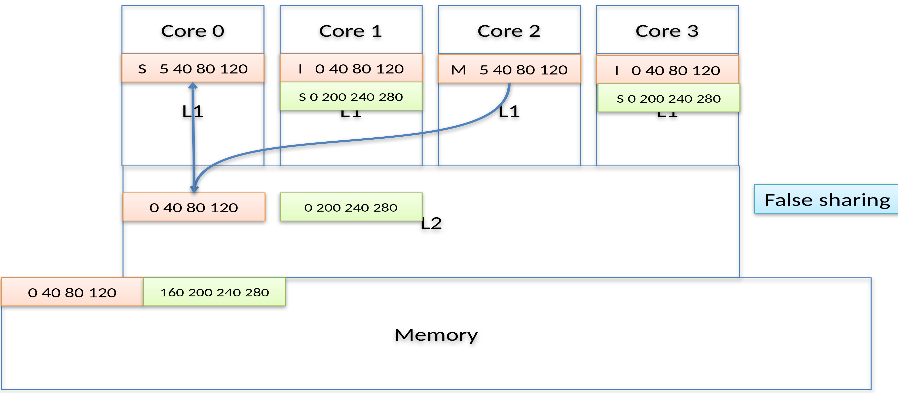

## C0: WRITE(8, 0);

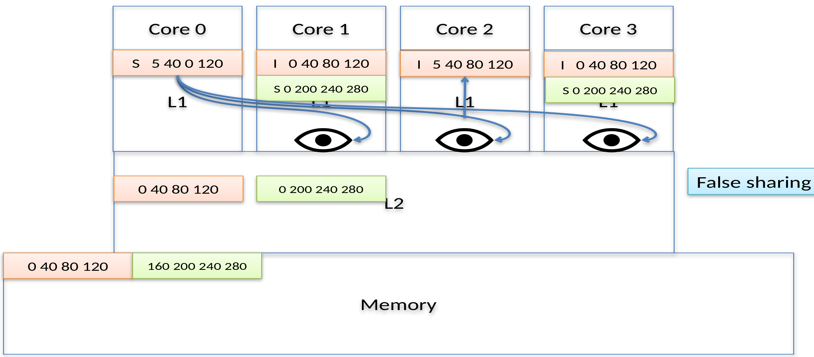

## Diretório

* Ponto centralizado para todas as informações de coerência
* Normalmente é armazenado dentro da cache de último nível (LLC) quando ela é inclusiva
* Para caches particionadas (split-caches), os diretórios também são particionados
  * Normalmente as L3 são particionadas
  * No exemplo a seguir, utilizaremos a L2 por questões de espaço

## Diagrama de uma cache particionada

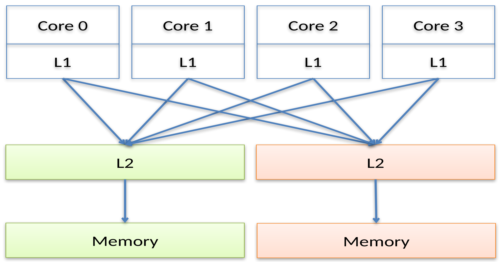

## Protocolo MSI em diretório em ação

Considerando uma cache com:

* Bloco de 16 bytes
* Protocolo MSI
* Diretório
* Valores de memória $M[i]=10i$
* Sistema com 4 cores, L1 privada, L2 compartilhada
* Diretório na L2

## Diagrama do sistema

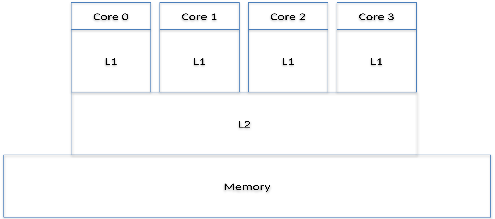

## C0: READ(0);

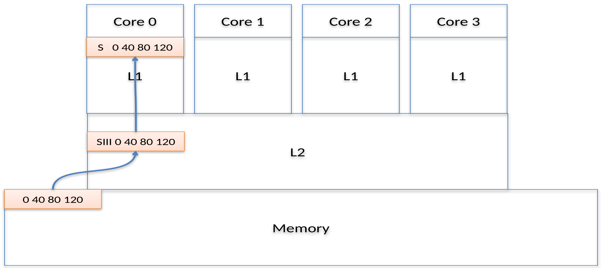

## C0: READ(0); C1: READ(0);

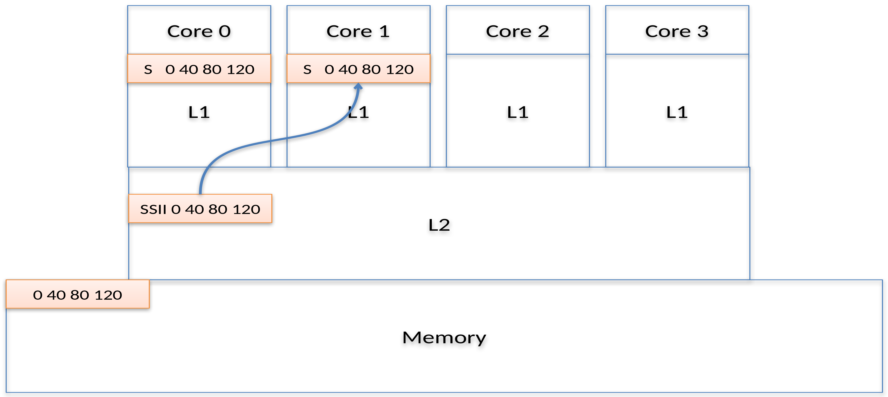

## C0: READ(0); C1: READ(0); C2: READ(0); C3: READ(0);

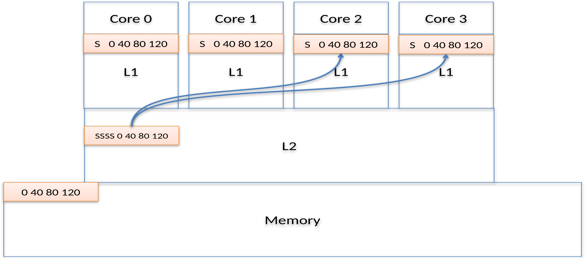

## C2: WRITE(0, 5);

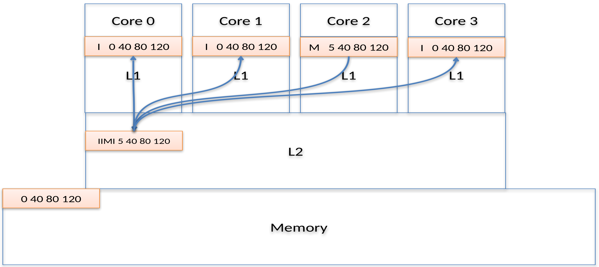

## C2: WRITE(0, 5); C0: READ(4);

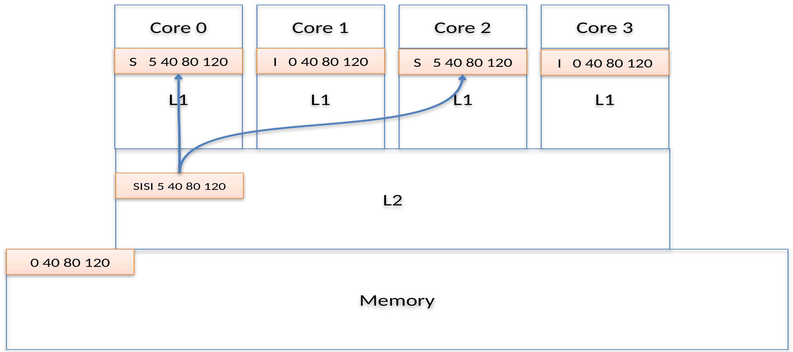

## C2: WRITE(0, 5); C0: READ(4); C0: WRITE(4, 0);

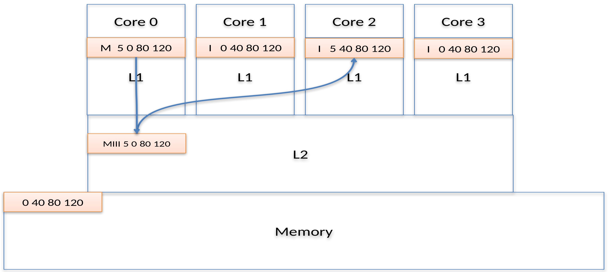

## Outros Protocolos

* **MESI**
  * **E**xclusive: bloco de cache possui o mesmo conteúdo que a memória e é a única cópia do dado
* **MOSI**
  * **O**wned: múltiplas caches podem possuir o mesmo valor mas somente uma está no estado **O**wned. Essa cache pode responder requisições de leitura das demais
* **MOESI**
  * Adiciona tanto **E**xclusive quanto **O**wned

## Exercício: MESI

## Exercício: MOSI

## Exercício: MOESI

