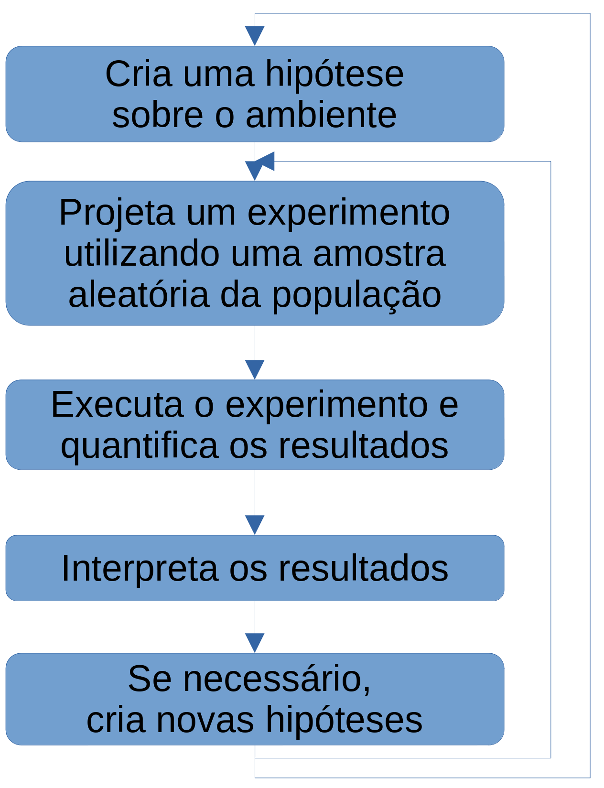
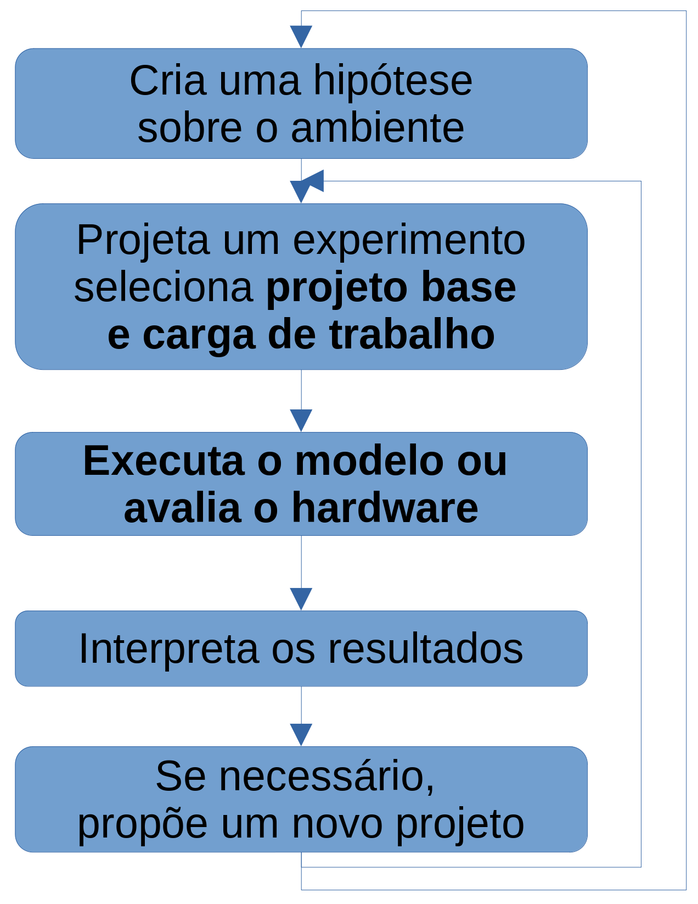
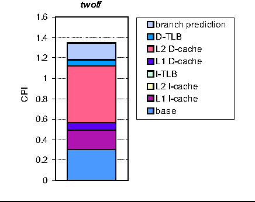

# Avaliação de Desempenho

**MO601 - Arquitetura de Computadores II**

http://www.ic.unicamp.br/~rodolfo/mo601

Rodolfo Azevedo - rodolfo@ic.unicamp.br

## Pesquisa Científica

* Busca comprovar uma hipótese utilizando uma amostra aleatória da população
* Caso a hipótese não possa ser comprovada, outra hipótese deverá ser criada

## Pesquisa em Sistemas Computacionais

* Também começa com uma hipótese
* Desenvolve um sistema para validar a hipótese, juntamente com os experimentos necessários
* Outros experimentos podem ser utilizados para coletar informações aprimoradas
* Deve tomar cuidado com a subjetividade

## Importância da avaliação de sistemas

* Avaliação de desempenho é uma parte importante da pesquisa em sistemas computacionais
* Utilizar apenas a intuição pode levar a conclusões erradas
* Outras métricas são relevantes, em especial: consumo e eficiência energética, e confiabilidade
  * Felizmente a metodologia de desempenho também se aplica nas outras áreas

## Passos relevantes para avaliação

* Escolha correta dos benchmarks (workload)
* Escolha do caso base (baseline)
* Metodologia de modelagem
* Metodologia de execução
* Forma de innterpretação dos resultados
* Escolha das métricas necessárias

## Métricas de desempenho

* Workloads single-thread
* Workloads multi-thread
* Benchmarks
* Métricas
  * User Time
  * System Time
  * Real Time

## Desempenho em single-thread

* Métrica de tempo

  $T=N \times CPI \times \frac{1}{f}$

  * $T$: Tempo de execução
  * $N$: Número de instruções úteis
  * $CPI$: Ciclos por instrução
  * $f$: Frequência do clock

## Origens do desempenho em single-thread

  $T=N \times CPI \times \frac{1}{f}$

* Diminuir o número de instruções
* Aprimorar a microarquitetura para reduzir o CPI
* Melhorar a implementação para aumentar a frequência

* Exemplo: do ganho de 75x em 10 anos (1990-2000) do x85
  * 13x pelo aumento da frequência
  * 6x por melhorias de microarquitetura

## CPI vs IPC

* Tratam-se de simétricos
  * $CPI=\frac{1}{IPC}$
* IPC é mais fácil de entender (Instruções por ciclo)
  * Quanto maior melhor
* CPI é mais fácil de calcular (Ciclos por instrução)
  * Permite montar as pilhas de IPC adicionando o impacto de cada componente microarquitetural no processo

## CPI Stack

* A figura ao lado indica como cada parte do processador impacta no CPI final
* Uma vez que alguns componentes aumentam o tempo de execução, o impacto deles pode ser calculado por instrução e adicionado ao CPI stack

## Desempenho em multi-thread

* É preciso considerar
  * Relação entre múltiplas threads concorrentes (locks, spin-locks, sequenciamento)
  * Efeitos de compartilhamento das caches
  * Efeitos de outras aplicações sendo executadas
  * Sistema Operacional
* Efeitos das métricas
  * O desempenho de um programa pode ser afetado em  até 65% por efeitos externos da hierarquia de memória

## Duas visões de desempenho

* Ponto de vista do usuário
  * Tempo de execução
  * Throughput
  * Tempo para completar uma única execução
* Ponto de vista do sistema
  * Tempo de resposta
  * Throughput
  * Quantas execuções ele completa por unidade de tempo

## Throughput

* Progresso normalizado (normalmente menor que 1)

  $NP_i=\frac{T_i^{SP}}{T_i^{MP}}$

  * $NP_i$: Normalized Progress
  * $T_i^{SP}$: Tempo de execução em single-thread
  * $T_i^{MP}$: Tempo de execução em multi-thread

> **Exemplo**: NP de 0,7 indica que o programa realiza 70% do trabalho de single thread quando executado em multithread. *Não estamos falando de paralelismo mas de interferência*.

## System Throughput

* Throughput do sistema (esperado que seja maior que 1)

  $STP = \sum_{i=1}^{n} NP_i = \sum_{i=1}^{n} \frac{T_i^{SP}}{T_i^{MP}}$

> Aqui já se tem a soma de todo o progresso de um sistema multiprogramado.

## Average Normalized Turnaround Time

* Normalize Turnaround Time

  $NTT_i=\frac{T_i^{SP}}{T_i^{MP}}$

* Average Normalized Turnaround Time

  $ANTT = \frac{1}{n} \sum_{i=1}^{n} NTT_i = \sum_{i=1}^{n} \frac{T_i^{SP}}{T_i^{MP}}$

  * $NTT_i$: Normalized Turnaround Time
  * $T_i^{SP}$: Tempo de execução em single-thread
  * $T_i^{MP}$: Tempo de execução em multi-thread

## As múltiplas médias

* Se a métrica é obtida dividindo A por B
  * Se A é dividido igualmente por todos os benchmarks
    * Média Harmônica
  * Se B é dividido igualmente por todos os benchmarks
    * Média Aritmética
* Média Geométrica
  * Distribuição log-normal
  * Agregação de efeitos multiplicativos
  * Utilizado pelo SPEC

## Média Harmônica

$H=\frac{n}{\sum_{i=1}^{n} \frac{1}{x_i}}$

* $x_i$: Valor de cada benchmark
* $n$: Número de benchmarks

> **Exemplo**: Utilizar uma amostra de 100 milhões de instruções para cada programa do benchmark. Ao calcular o IPC médio, deve-se utilizar a média harmônica. Vale para MIPS também.

## Média Aritmética
  
$A=\frac{1}{n} \sum_{i=1}^{n} x_i$

* $x_i$: Valor de cada benchmark
* $n$: Número de benchmarks

> **Exemplo**: Utilizar uma amostra de 100 milhões de instruções para cada programa do benchmark. Ao calcular o CPI médio, deve-se utilizar a média aritmética.

## Média Geométrica

$G=\sqrt[n]{\prod_{i=1}^{n} x_i}$

* $x_i$: Valor de cada benchmark
* $n$: Número de benchmarks
