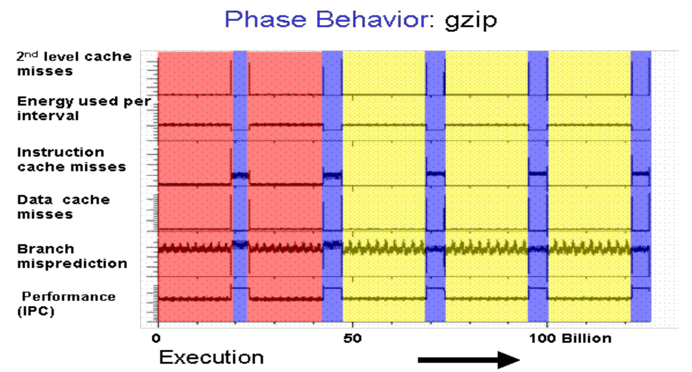
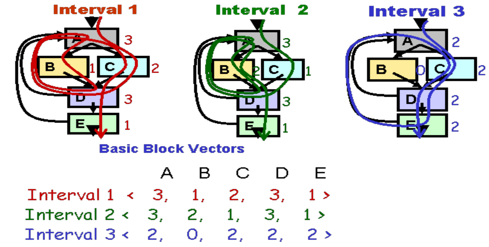
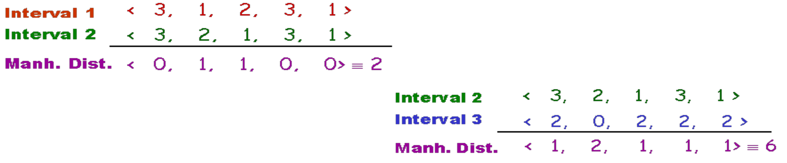
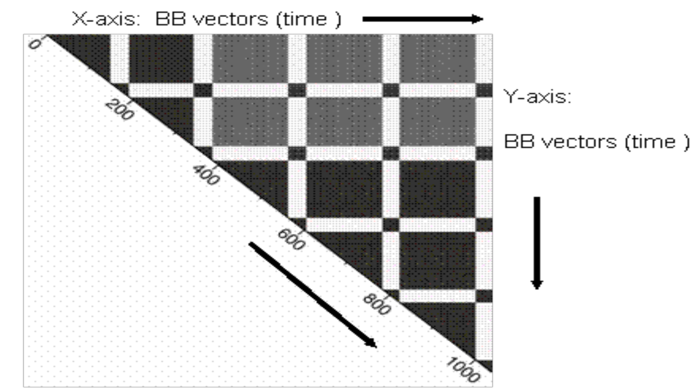
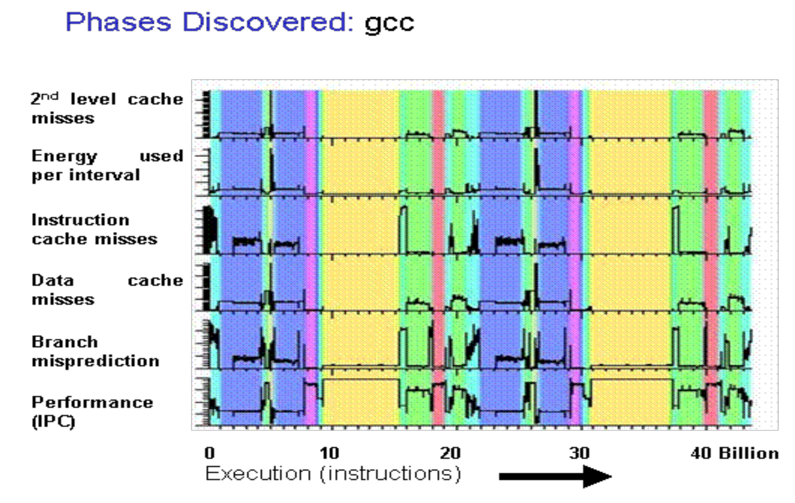
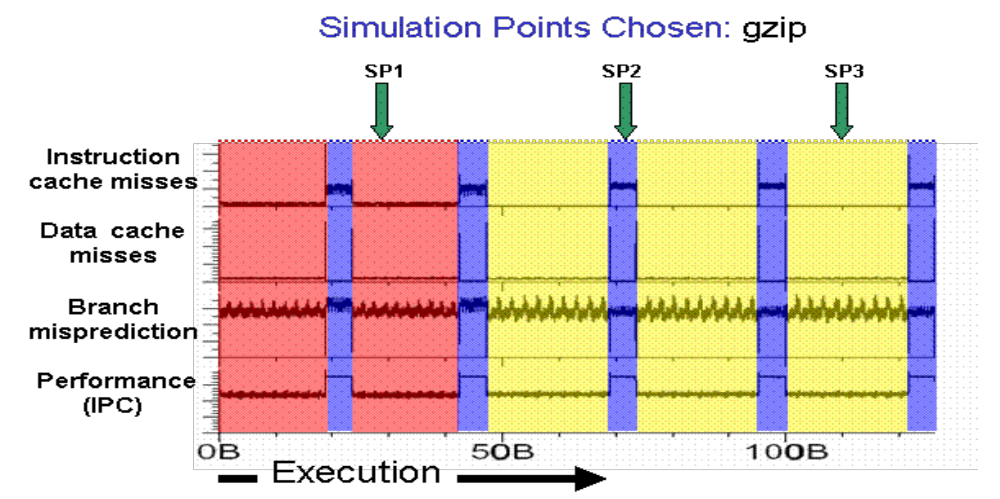
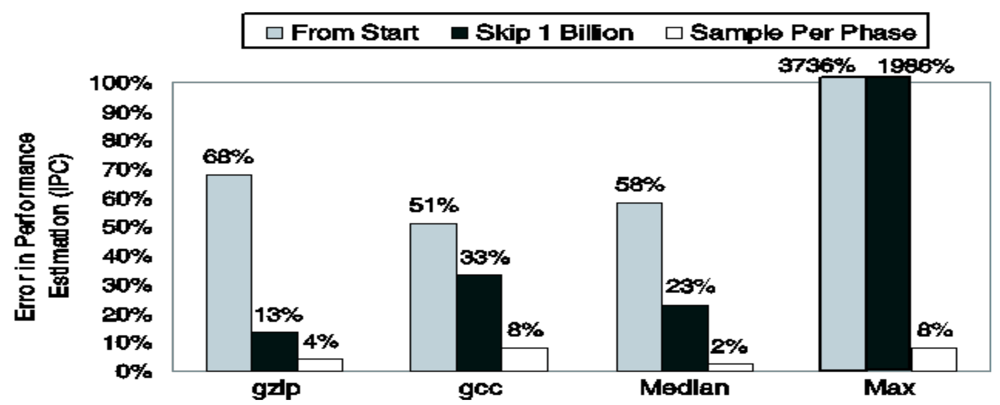
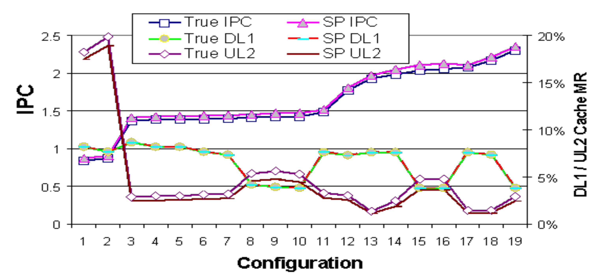
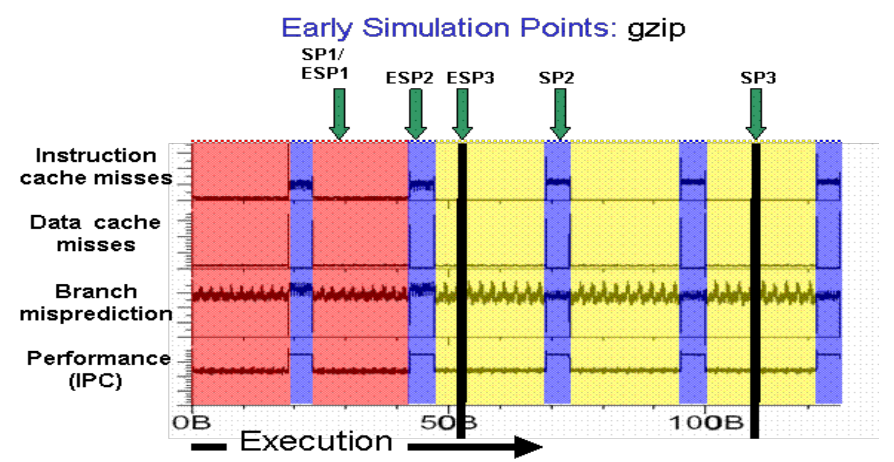

# Simpoints

**MO601 - Arquitetura de Computadores II**

http://www.ic.unicamp.br/~rodolfo/mo601

Rodolfo Azevedo - rodolfo@ic.unicamp.br

## SimPoints

### Apresentação baseada no artigo

*Timothy Sherwood, Erez Perelman, Greg Hamerly, Suleyman Sair, and Brad Calder, Discovering and Exploiting Program Phases, IEEE Micro: Micro's Top Picks from Computer Architecture Conferences, December 2003.*

http://cseweb.ucsd.edu/~calder/simpoint/index.htm

## Motivação

* Necessidade de simular cargas de trabalho imensas
  * Simuladores com precisão de ciclo são lentos
  * Exploração do Espaço de Projeto exige muitas simulações
* Simulações completas podem demandar meses para completar
* Análise de fase fornece uma alternativa eficiente e precisa para o problema

## Exploração do Espaço de Projeto

* Suponha um sistema computacional que precise avaliar parâmetros de uma cache:
  * Tamanho do bloco
  * Associatividade
  * Tamanho da cache
  * Política de substituição
* Se cada parâmetro tiver 4 valores, o espaço de projeto terá 256 combinações
* Se adicionar configurações do processador, protocolos de coerência, etc, o espaço de projeto pode ter bilhões de combinações

## Alternativas

* Diminuir as entradas dos benchmarks
* Cortar o tempo de execução
  * Executar as primeiras X instruçoes (ex.: 5 bilhões de instruções)
  * Pular as primeiras X instruções e executar as próximas Y instruções (ex: pular 1 bilhão de instruções e executar as próximas 5 bilhões de instruções)

## Fases dos programas

* Fases são partes de um programa que se comportam de forma similares
* Existe um número pequeno de fases em um programa
* É possível coletar parâmetros da execução do programa considerando essas partes
  * Há uma boa correlação positiva
* Programas possuem várias fases
* Existem fases similares
  * Um SimPoint é o melhor representante dentre fases similares

## Definições sobre SimPoints

* **Intervalo**: Sequência contínua de execução de um programa (ex.: 1, 10 ou 100 milhões de instruções, ou mesmo um número variável)
* **Fase**: Conjunto de intervalos com o mesmo comportamento, independente de onde ocorrem no programa
* **Classificação de fase**: Quebra a execução do programa em fases com comportamento similar
* **Similaridade**: Indica quão próximo dois intervalos são
* **Métrica de similaridade**: Métrica independente de hardware para detectar a similaridade
* **Troca de fase**: Troca de comportamento do programa ao longo do tempo

## Exemplo (gzip)

## Observações sobre as fases

* Existem 3 fases: vermelha, azul e amarela
* O comportamento das métricas arquiteturais se alteram juntamente com as demais métricas
* Fases cobrem grandes trechos de execução
* O comportamento entre as fases pode variar significativamente
* Não há uma estrutura clara de repetição para todas as fases

## A técnica de SimPoint

* **Basic Block Vector Analysis**: Profile independente de hardware
* **Random Projection**: Redução de dimensionalidade dos dados
* **Classificação das fases**: Classifica todos os intervalos em um conjunto de fases (K-Means)
* **Escolha dos SimPoints**: Encontra uma boa representação da execução utilizando uma amostra de cada fase

## Basic Block Vector Analysis

## Basic Block Vectors

* Vetor de uma dimensão com um elemento para cada bloco básico estático do programa
* Em cada intervalo, conta a execução de cada bloco básico, ponderado pelo número de instruções no bloco básico
* Normaliza o resultado dividindo cada elemento pela soma de todos os elementos do vetor

## Similaridade

* Calcula a distância de Manhattan entre BBV
  * Distância de Manhattan = soma das diferenças absolutas entre os elementos dos vetores
* Pequenas distâncias indicam que os vetores são similares
  * Potencialmente pertencem à mesma fase

## Matriz de similaridade (gzip)

## Exemplo de fases (gcc)

## Simpoints escolhidos (gzip)

## Avaliando a qualidade

* Utilizando 100 milhões de instruções por intervalo (cluster)
* **Do início**: simula 300 milhões de instruções
* **Salto**: simula 300 milhões de instruções após saltar 1 bilhão de instruções
* **Simpoints**: simula 3 amostras de 100 milhões de instruções cada

## Qualidade dos Simpoints

## Independência de microarquitetura

## Early Simulation Points

## Como executar apenas um pedaço do programa?

* Existe um conjunto de ferramentas que ajudam nessa parte
  * Geração de *snapshots* do estado do processador
  * Execução determinística de código
* Pin
* PinPlay
* PinPoints
