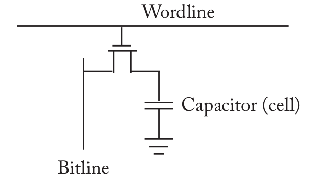
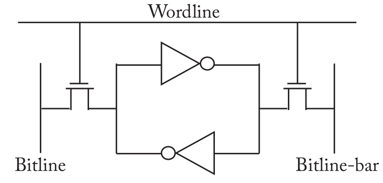
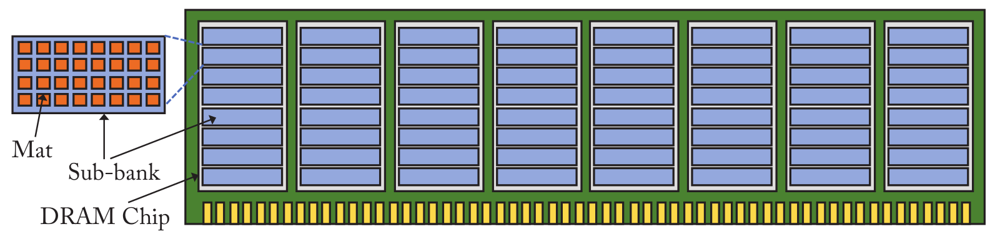

# Memória

**MO601 - Arquitetura de Computadores II**

http://www.ic.unicamp.br/~rodolfo/mo601

Rodolfo Azevedo - rodolfo@ic.unicamp.br

## Visão Geral

* Memória é um dos componentes mais importantes de um sistema computacional, mas nem sempre é analisada com a devida atenção.
* Vários parâmetros precisam ser avaliados para uma correta avaliação do sistema de memória.
* Avanços recentes ocorreram em áreas como segurança, velocidade, compressão, confiabilidade, processamento e escalabilidade.
* Vamos falar sobre alguns conceitos básicos de memória e sobre alguns avanços recentes.
* *Muitos termos serão utilizados diretamente em inglês nos slides.*

## DRAM vs SRAM

* DRAM (Dynamic Random Access Memory)
  * Armazena dados em capacitores
  * Capacitores precisam ser recarregados periodicamente
  * Mais densa, mais barata, mais lenta
* SRAM (Static Random Access Memory)
  * Armazena dados em circuitos lógicos
  * Não precisa ser recarregada periodicamente
  * Menos densa, mais cara, mais rápida

## DRAM

* Utiliza uma célula capacitiva e um transistor para armazenar um bit
* Toda leitura remove a carga do capacitor, por isso precisa ser recarregado em seguida
* A carga do capacitor também vaza, por isso precisa ser recarregado periodicamente
* A recarga periódica é chamada de **refresh**

## SRAM

* Utiliza 6 transistores para armazenar um bit
* Não precisa ser recarregada periodicamente
* Não precisa ser recarregada após uma leitura
* Mais rápida que a DRAM

## Memory Channel - Canal de memória

* O Controlador de Memória, que normalmente fica no processador, é o responsável por enviar comandos para o sistema de memória.
* Chips de memória são "burros" e precisam de controladores bem detalhados.
* O canal de memória é dividido em canais de:
  * dados: bidirecional com **d** bits de dados
  * endereço/controle: unidirecional com **a** bits de endereço e **c** bits de controle
* Um tamanho típico é $a=17$, $c=15$, $d=64$.

## DDR

* DDR é um padrão definido pelo consórcio JEDEC* O canal de memória opera numa frequência mais lenta que o processador
* Para minimizar a diferença, ele trabalha com transmissão nas duas bordas do clock (subida e descida)
* Cada fio do canal de dados transmite 2 bits por ciclo de clock
* O canal de endereços/controle transmite somente 1 bit por ciclo de clock
* Para a frequência de 1200MHz, a memória é anunciada como DDRx 2400
* Uma consequência da alta frequência é o pequeno comprimento e a pequena capacidade de suportar múltiplos módulos
* Sistemas modernos costumam ter múltiplos canais de memória

## Subdivisões

* Um módulo de memória do computador é chamado de DIMM (Dual Inline Memory Module).
* Pelo padrão JEDEC, um DIMM pode ser trocado por outro de mesma geração.

## Rank

* Um DIMM é dividido em 1, 2 ou 4 rRnks. 
* Um Rank é um conjunto de chips de memória que compartilham o mesmo canal de endereço/controle.
* Se o chip fornece 8 bits, ele é chamado de x8 e um Rank precisa de 8 deles para fornecer 64 bits de dados.

## Continuando sobre Ranks

* Um Rank pode ter: 64 x1 chips, 32 x2 chips, **16 x4 chips, 8 x8 chips, 4 x16 chips**, 2 x32 chips ou 1 x64 chips.

## Conexões

* Cada fio de dados do canal de memória é conectado a um único chip de DRAM do Rank.
* Se o canal suporta 4 Ranks, o fio precisa estar conectado em 4 chips diferentes.
* Um fio do canal de endereços/controle é conectado a todos os chips do Rank.
* Para reduzir essa carga, existem memórias que incluem um buffer nos endereços/controle.

## Temporização

* Uma leitura de um Rank demora **muito** tempo (~40ns).
* Múltiplas requisições podem ser atendidas em paralelo, em pipeline
  * A requisição é enviada através do barramento de endereço/comando (~1ns);
  * Os chips envolvidos no Rank ativam os circuitos e fazem a leitura dos dados (~35ns);
  * O dado requisitado é retornado pelo barramento de dados (~5ns).
* Para tornar o pipeline eficiente, múltiplas requisições precisam estar no segundo estágio em paralelo.
* Para isso, cada Rank é dividido em 8 Banks.

## Banks

* Um canal de memória com suporte a 4 Ranks e 8 Banks por Rank pode ter 32 requisições em paralelo.
* Cada Bank pode trabalhar independentemente.
* Da figura, cada Rank é dividido em 8 Banks, logo cada Bank está distribuído em 8 chips.

## Organização dos Banks

* Cada parte do Bank dentro de um chip é chamado de sub-bank.
* Cada sub-bank é dividido em subarrays e mats.
* A suborganização é feita para reduzir conexão entre os componentes.

## Colocando tudo junto

> Detalhe uma leitura de uma cache line de 64 bytes

## Colocando tudo junto

> Suponha uma leitura de uma cache line de 64 bytes

* Se o Rank tiver 8 x8 chips, cada chip fornecerá 64 bits para a transferência de cache.
* Esses 64 bits estão divididos em múltiplos mats dentro do sub-bank.
* Serão necessárias 8 transferências de dados para completar a leitura.
* Essas 8 transferências podem ser feitas em 4 ciclos por causa do DDR.

## Transferência de dados

* Cada mat é uma matriz de células DRAM (512 linhas e 512 colunas = 512Kb)
* O wordline é o fio horizontal que conecta todas as células de uma linha
* A requisição de dados ativa uma única wordline em cada mat envolvido
* As bitlines são os fios verticais que transferem os dados

## Row Buffer

* Ao final dos bitlines ficam os Sense Amplifiers que interpretam os sinais das bitlines
* Gasta-se ~13ns para transferir para o Sense Amplifier
* Essa transferência é chamada de Row Activation
* Considerando a leitura de 64 bytes (512 bits) vindos de 64 mats, os Sense Amplifiers vão armazenar 4KB de dados!
* Esse conjunto de dados é chamado de Row Buffer
* O comando que inicia esse processo é o RAS (Row Address Strobe)
* Muitos dados foram lidos, recuperar a coluna correta é feito pelo comando CAS (Column Address Strobe)

## Desempenho

* Somente uma Row pode ser ativada por vez num Bank.
* Antes de ler uma Row, é preciso recarregar as bitlines (~13ns), perdendo os dados dos sense-amplifiers.
* 3 tipos de acesso à memória são possíveis:
  * Row buffer hit: a Row já está ativa, basta ler a coluna (~13ns)
  * Empty Row access: a Row não está ativa, é preciso ativar e ler a coluna (~26ns)
  * Row buffer conflict: a Row está ativa, mas é preciso ativar outra Row (~39ns). Esse é o caso mais complexo envolvendo precharge, activate e data transfer. 
* Um LLC miss pode gastar mais de 100ns: 60ns até chegar no controlador de memória, 39ns para acessar a memória e 4ns para retornar.

## Capacidade vs Energia

* Aqui há um claro tradeoff entre:
  * Menos chips por Rank (ex.: 4 x16 2Gb chips) vai ativar menos chips, reduzindo o consumo de energia mas com capacidade máxima de 8Gb.
  * Mais chips por Rank (ex.: 16 x4 Gb chips) vai ativar mais chips
 e gastar mais energia, mas com capacidade máxima de 32Gb.

## Mapeamento de Endereços

* O controlador de memória pode mapear o endereço de diferentes formas, distribuindo os dados de formas diferentes.
* Programas exercitam localidade espacial acessando cache lines consecutivas.
* Para ampliar hit no Row Buffer, cache lines consecutivas podem ser colocadas na mesma Row.
* Para promover paralelismo, cache lines consecutivas podem ser colocadas em Ranks ou Banks diferentes.

> Row : Rank : Bank : Channel : **Column** : blkoffset
> Row : **Column** : Rank : Bank : Channel : blkoffset

## Escalonamento

* O controlador de memória possui toda a inteligência do sistema.
* Ele deve considerar características como: desempenho, energia e justiça.
* O escalonador deve tentar manter a Row aberta para reduzir o tempo de acesso. Esse mecanismo é chamado de Open Page Policy.
* Mas Open Page pode gastar tempo demais quando o acesso for em outra Row, então existe a política de Close Page para aplicações com pouca localidade.
* Há um custo (~7,5ns) para trocar a direção do barramento de dados, então leituras e escritas são agrupadas.
* Leituras têm preferência e escritas são feitas quando o Write Buffer encher.
* Essas otimizações não podem favorecer um core em relação aos demais visto que a memória é compartilhada entre eles.

## Refresh

* Uma célula de DRAM perde sua carga em 64ms.
* Toda Row ativada é automaticamente recarregada
* Como nem toda Row é ativada a cada 64ms, é necessário fazer um Refresh de todas as Rows do sistema.
* Cada janela de refresh de 64ms é dividida em 8.192 sub-janelas de 7,8$\mu$s.
* A cada sub-janela, o controlador executa um comando de Refresh e mantem a memória ocupada por algumas centenas de ciclos de clock.
* Cada Refresh é de algumas linhas de todos os Banks e Ranks do canal.

## Temporizações

* As temporizações da memória tem nomes padronizados e facilitam o desenvolvimento de novos módulos de memória bem como de controladores.
* Uma análise detalhada de memória normalmente utiliza fórmulas baseadas nesses nomes/tempos.
