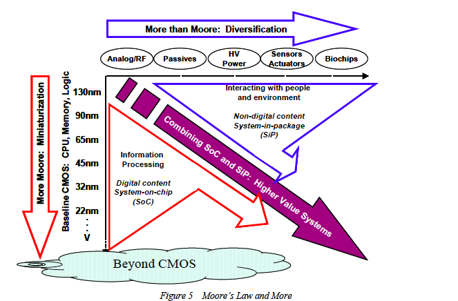
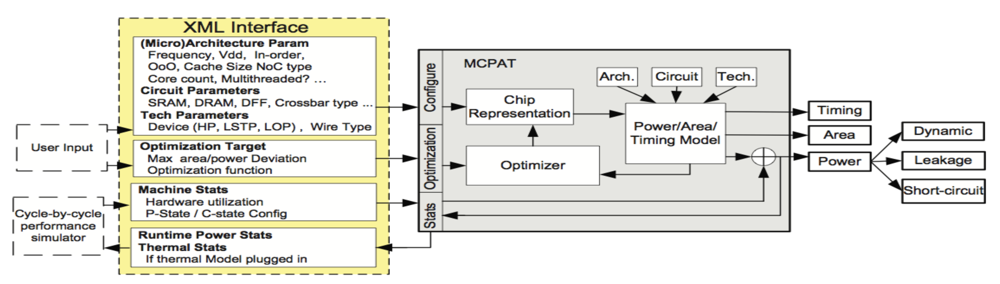
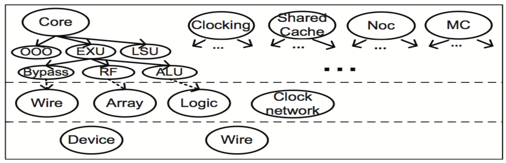

# McPAT

**M**ulticore **P**ower, **A**rea, and **T**imming

**MO601 - Arquitetura de Computadores II**

http://www.ic.unicamp.br/~rodolfo/mo601

Rodolfo Azevedo - rodolfo@ic.unicamp.br

## Noções de Consumo de Energia

* Consumo dinâmico
  * Toda vez que um bit é trocado, energia é consumida
  * Trabalho está sendo realizado: energia dissipada
* Consumo estático
  * Também conhecido como *leakage power*
  * Energia consumida por dispositivos ligados/ativos
  * Dispositivo *idle* dissipa energia
* Energia de curto-circuito
  * Energia consumida durante um curto período de tempo de transição entre estados

## IRTS

* International Technology Roadmap for Semiconductors
* Relatório que descreve as tendências da indústria de semicondutores (até 2015)
* Descreve as tendências de várias tecnologias e processos
* Se quiser olhar o futuro, olhe o relatório do ITRS

### Suplantado pelo IRDS

## IRDS

* International Roadmap for Devices and Systems

## Ferramentas para consumo de energia

* CACTI para hierarquia de memória
  * Primeira ferramenta para estimativa rápida de consumo de energia, área e temporização de memória
* Wattch para estimativa de consumo para processador
  * Fomentou o surgimento de várias pesquisas em consumo de energia
* Orion para Network on Chip
  * Combinou o modelo do Wattch para *cores* a um modelo de roteamento

## Problemas com as demais ferramentas

* CACTI
  * Sem integração com outras ferramentas
* Wattch
  * Sem análise de temporização e área
  * Somente modelos para consumo dinâmico
  * Utiliza um modelo de escalabilidade linear simples
* Orieon2
  * Sem modelo de curto circuito
  * Sem temporização
  * Incompleto

## McPAT: Abordagem Integrada

* Energia
  * Dinâmica: similar ao Wattch
  * Curto circuito: IEEE TCAD'00
  * Leakage: Mastar & Intel
* Temporização
  * CACTI com extensões
* Area
  * CACTI
  * Modelo empírico para lógicas mais complexas

## Características de Processadores

* In-order e Out-of-order
* Single e Multi-thread
* Low Power
* Caches compartilhadas e coerentes
  * Com diretórios
* Network on chip (NoC)
* Controlador de memória on-chip
* Controladores de E/S on-chip

## Modelos base

* Modelo base para In-Order baseado no Sun Niagara
* Modelos out-of-order baseados em:
  * Intel P6 para estação de reserva
  * Intel Netburst e Alpha 21264 para banco de registrador físico
* Processador low-power embarcado baseado no ARM Cortex A9

## Processos tecnológicos

* Usa ITRS para estimar o consumo de energia
  * 90nm, 65nm, 45nm, 32nm, 22nm
* Utiliza transistores diferentes de acordo com a tecnologia
* Suporte a DVFS
* Busca por projetos ótimos para satisfazer a frequência alvo
* Restrições de temporização incluem *throughput* e latência

## Diagrama de bloco

## Modelo hierárquico

## Nível Arquitetural

* Core
  * Dividido em várias unidades principais: IFU, EXU, LSU, OOO issue/dispatch
* NoC
  * Links de sinalização
  * Roteadores
* Caches on-chip com suporte a coerência
* Controlador de memória
  * Principais estruturas de hardware (3)
  * Modelo empírico para a estrutura física
* Clock
  * PLL e lógica de distriuição com modelo empírico

## Nível de circuito

* Fios
  * Modelos para conexões curtas e longas
* Arrays
  * Baseado no CACTI com extensões
* Lógica
  * Regular: CACTI
  * Pouco regular: modelo da Intel, AMD e SUN
  * Altamente customizada: Empírico, da Intel e SUN
* Rede de distribuição de clock
  * Modelo separado do circuito
  * Global, domínio e local
